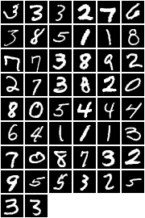
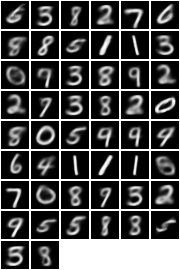
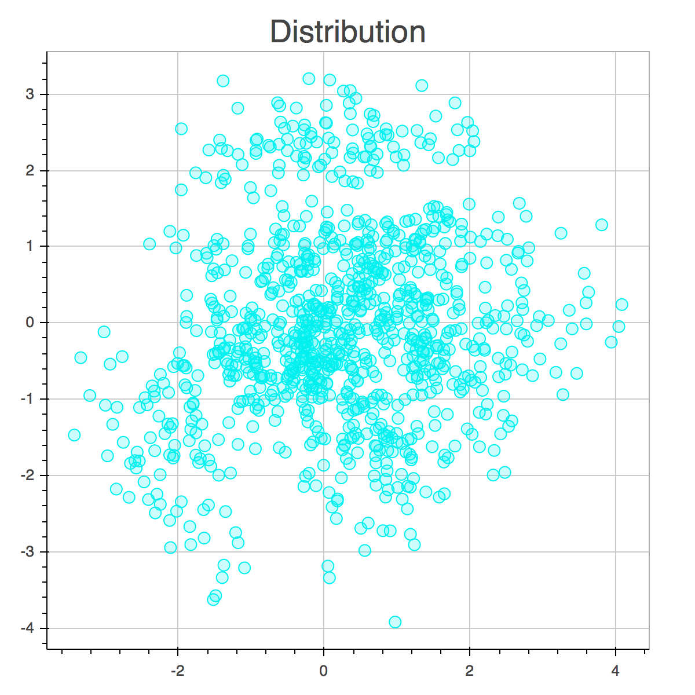
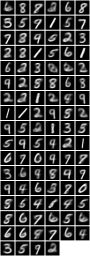

```lua
lfs=require 'lfs'
if string.find(lfs.currentdir(), 'visualization') then
    lfs.chdir('../')
end
require 'utils/MnistManager'
require 'models/Vae'
require 'optim'
require 'cunn'
Plot = require 'itorch.Plot'
cmd = {h_size = 400, z_size = 2}
```


```lua
N = 50
data = MnistManager(50):cuda()
saved = torch.load('save/Vae.t7')
vae = saved.vae
```

# Image Reconstruction


```lua
data:shuffle()
input = data:next()[1]
mu, logv, recon = unpack(vae.model:forward(input))
-- original image
itorch.image(input:reshape(N, 1, 28, 28))
-- reconstructed image
itorch.image(recon:reshape(N, 1, 28, 28))
```








# Encoding Distribution


```lua
-- I'll add colors once I actually get the labels for mnist
colors = {'#F00000', '#00F000', '#0000F0', 
          '#F0F000', '#F000F0', '#00F0F0', 
          '#909000', '#009090', '#900090',
          '#404000'}
```


```lua
data = MnistManager(1000):cuda()
data:shuffle()
input = data:next()[1]
mu, logv, recon = unpack(vae.model:forward(input))
plt = Plot()
plt:circle(mu[{{},1}], mu[{{},2}], '#00F0F0')
plt:title("Distribution")
plt:draw()
```



<script type="text/javascript">
$(function() {
    if (typeof (window._bokeh_onload_callbacks) === "undefined"){
  window._bokeh_onload_callbacks = [];
    }
    function load_lib(url, callback){
  window._bokeh_onload_callbacks.push(callback);
  if (window._bokeh_is_loading){
      console.log("Bokeh: BokehJS is being loaded, scheduling callback at", new Date());
      return null;
  }
  console.log("Bokeh: BokehJS not loaded, scheduling load and callback at", new Date());
  window._bokeh_is_loading = true;
  var s = document.createElement('script');
  s.src = url;
  s.async = true;
  s.onreadystatechange = s.onload = function(){
      Bokeh.embed.inject_css("https://cdn.pydata.org/bokeh-0.7.0.min.css");
      window._bokeh_onload_callbacks.forEach(function(callback){callback()});
  };
  s.onerror = function(){
      console.warn("failed to load library " + url);
  };
  document.getElementsByTagName("head")[0].appendChild(s);
    }

    bokehjs_url = "https://cdn.pydata.org/bokeh-0.7.0.min.js"

    var elt = document.getElementById("23560b0b-3267-4c1a-ccf3-960d3e751db7");
    if(elt==null) {
  console.log("Bokeh: ERROR: autoload.js configured with elementid '23560b0b-3267-4c1a-ccf3-960d3e751db7'"
        + "but no matching script tag was found. ")
  return false;
    }

    if(typeof(Bokeh) !== "undefined") {
  console.log("Bokeh: BokehJS loaded, going straight to plotting");
  var modelid = "7f26662f-9866-430e-c3cb-5a97b8db7579";
  var modeltype = "Plot";
  var all_models = [{"id":"576cd5e0-b854-47c7-c7aa-6667e860a3bc","type":"ColumnDataSource","attributes":{"data":{"y":[0.25754106044769,-0.38388162851334,-0.57304209470749,2.3057606220245,0.26015496253967,1.124541759491,-0.32262086868286,-0.46948516368866,-1.1466119289398,0.34416323900223,-0.98955464363098,-2.0101633071899,0.16324464976788,0.42162519693375,-0.86841768026352,-1.809259057045,0.79113119840622,-3.1743013858795,-0.80808210372925,0.48174560070038,1.1670078039169,-1.198429942131,0.025644913315773,-1.1619664430618,-0.6898193359375,0.81327247619629,-0.55783754587173,0.99545508623123,-0.8007635474205,-0.46585500240326,-1.6034780740738,-1.5060331821442,-1.6226258277893,1.5962227582932,0.93789058923721,1.1210135221481,1.2955919504166,-0.30251640081406,-1.283501625061,-0.88464587926865,1.2573636770248,-0.52840387821198,-0.93416965007782,-1.4565296173096,-1.9389444589615,0.18305449187756,-1.8776582479477,-1.0363374948502,1.1337920427322,-1.7946289777756,-0.19928705692291,-0.7137622833252,-2.1563670635223,-1.7703984975815,0.49120682477951,1.4525750875473,-1.1088715791702,-2.3865916728973,-0.29367905855179,0.54142427444458,2.8520765304565,1.3876017332077,-1.0775810480118,-1.3542895317078,-0.52361136674881,0.81232458353043,-1.6890317201614,0.37851941585541,0.34233725070953,2.3625135421753,0.32952398061752,-1.4540886878967,3.0450949668884,0.028044462203979,-0.63675653934479,2.5946063995361,-0.3824550807476,1.5571602582932,2.3545296192169,0.69475507736206,-0.06021337211132,2.0658082962036,-0.69051510095596,-0.3718703687191,0.051705405116081,-2.2852923870087,0.23220433294773,2.3939526081085,-2.2390053272247,-0.47160392999649,0.91305273771286,-0.047184601426125,3.1730940341949,0.41203904151917,1.0414440631866,-2.4122326374054,-0.66598618030548,0.21564610302448,0.4772441983223,-0.43192440271378,-0.20610386133194,-0.72713524103165,2.2090363502502,-1.9881000518799,-0.97462737560272,-0.43628311157227,0.093270942568779,2.3777668476105,0.22542242705822,0.17461328208447,0.98534685373306,-0.25173443555832,-0.57137900590897,0.033814758062363,1.2307883501053,0.84735852479935,-0.087138868868351,2.6186978816986,-0.8097762465477,-1.7671768665314,-2.8803126811981,-2.2441370487213,-0.41358786821365,-0.34904557466507,0.74366909265518,-3.3374183177948,0.46458834409714,-0.44009250402451,1.4202737808228,-0.69526129961014,-1.1172461509705,-0.35654604434967,-0.50881361961365,-0.54995852708817,-0.034920684993267,1.0534232854843,-1.0386924743652,-0.27291703224182,-0.78098678588867,0.031448796391487,-0.0036356598138809,0.30810302495956,-1.4499877691269,1.1966025829315,1.3519439697266,0.87733143568039,0.90679353475571,-2.7478721141815,0.5978336930275,0.96304422616959,-1.5130161046982,1.0132794380188,-2.331386089325,-0.4375411272049,-1.5177500247955,-0.7623924612999,-0.097547307610512,-0.3218132853508,-0.1339653134346,-0.58821755647659,0.98262602090836,2.6384813785553,1.1436514854431,0.82188183069229,2.069260597229,2.3433027267456,-1.1981474161148,0.0061850696802139,2.7188203334808,-0.39588108658791,-0.78736931085587,-1.3060618638992,1.1859636306763,0.70109820365906,-0.32660305500031,-0.47418874502182,-0.068311341106892,1.5267288684845,-0.52467721700668,-1.3435950279236,-1.6093378067017,-1.0502035617828,-0.10133448988199,0.71613025665283,2.0664184093475,0.03816345334053,-1.3198101520538,-1.1717797517776,0.18530465662479,0.20296160876751,0.66183084249496,-0.10152503848076,1.2260105609894,-1.670857667923,0.15210102498531,-0.89309567213058,-1.3696225881577,-0.56834089756012,3.038763999939,0.017540633678436,-0.82545870542526,0.89252334833145,-0.36761230230331,-1.5437605381012,-0.14785222709179,-1.3263618946075,-2.3771722316742,-0.76880395412445,-0.21767519414425,-0.012064322829247,1.0972427129745,-0.34153485298157,-0.00072236359119415,2.4686007499695,0.63297659158707,-1.5998375415802,-0.42973589897156,-0.47710657119751,-1.0316013097763,-2.4469544887543,-1.146505355835,-0.61204349994659,-1.6144251823425,2.7394285202026,-0.24795392155647,-1.6358946561813,-1.3599328994751,-0.68803429603577,1.0967075824738,-0.74662494659424,-0.12580640614033,-1.5033428668976,0.24435611069202,1.0828856229782,-0.27062427997589,-1.8341628313065,0.080968797206879,-3.3401122093201,-1.7408065795898,2.2021455764771,-0.7054837346077,-2.1520018577576,1.1643184423447,0.77481096982956,0.17234052717686,2.1865756511688,1.4484214782715,-0.53707367181778,0.078783541917801,1.0286823511124,-1.7292807102203,0.57905220985413,-0.67103725671768,0.46839785575867,2.1347639560699,-0.40509659051895,-0.52402639389038,1.0378482341766,-0.72061276435852,-0.19366016983986,-0.51934278011322,0.38240218162537,-0.50675678253174,2.1014094352722,0.10665298998356,0.25656181573868,0.59214800596237,0.71219682693481,-2.4370017051697,-3.5743908882141,-0.66128170490265,-0.649034678936,-0.97964775562286,-0.67801517248154,-1.4407523870468,-1.0266399383545,-0.26927360892296,0.8958016037941,1.2701852321625,0.31039535999298,1.5172387361526,-1.39908015728,0.84803533554077,-2.3141875267029,1.8381370306015,-2.4893743991852,0.037136122584343,-1.1107820272446,2.1805305480957,-1.6676241159439,-0.39686426520348,-0.33441635966301,-0.68902415037155,2.5798423290253,-0.043477289378643,1.3449566364288,1.5682916641235,-0.72235268354416,-0.074699252843857,0.032457083463669,-0.455157995224,-0.46757930517197,-1.529268860817,-0.91085457801819,-0.58898770809174,0.29792875051498,0.097440794110298,-0.44746077060699,-0.67766237258911,-0.92765301465988,-0.12815080583096,1.2085587978363,-0.61005359888077,-2.5885436534882,2.5294849872589,0.4169510602951,-0.38060241937637,0.28821808099747,2.6286106109619,-1.0052511692047,-0.038709834218025,-2.6229386329651,-0.27643060684204,-0.97150135040283,0.52427917718887,-1.5107828378677,-0.073158994317055,-1.5292016267776,0.95721381902695,-0.12874001264572,-0.57959944009781,1.4013379812241,-0.48441183567047,-0.37807255983353,2.0468444824219,-0.93954104185104,2.8857319355011,-0.53846901655197,0.57009780406952,-0.55260038375854,0.65756767988205,2.2610785961151,0.67628592252731,2.1832916736603,-0.20127774775028,-1.5189990997314,1.2856470346451,-0.49286770820618,2.6326959133148,-0.52166414260864,-1.8647327423096,-0.97510081529617,-1.2974472045898,-0.84215182065964,-2.4673204421997,2.1618058681488,1.1617287397385,0.65730541944504,1.9029564857483,-1.7784225940704,0.91584628820419,-0.94432067871094,0.83477926254272,1.2468501329422,-0.13329263031483,0.24860472977161,-0.57059305906296,-0.12068645656109,1.2141778469086,-1.5510896444321,-0.0013491362333298,-0.22561055421829,-0.46282416582108,1.0350283384323,0.86904782056808,0.5091906785965,2.5174279212952,2.4870235919952,-0.53013050556183,0.56073349714279,2.4100501537323,-1.0017490386963,1.2025073766708,0.36213999986649,-0.53966814279556,2.3072941303253,0.8423182964325,0.69890922307968,0.7882479429245,-2.7227358818054,1.2964409589767,1.2863638401031,-0.7462369799614,-0.65331357717514,0.67490184307098,0.88350254297256,2.1760656833649,-0.16734582185745,2.7110590934753,2.3651268482208,-0.86850696802139,-1.0664083957672,0.66620337963104,0.73697263002396,0.5668044090271,1.3021290302277,2.8145077228546,1.1492394208908,-0.20664331316948,-0.12623172998428,0.17630912363529,1.9353530406952,-0.41364866495132,-0.56281131505966,2.2255866527557,0.76844048500061,0.035309508442879,2.2599902153015,-0.82637214660645,1.2718213796616,1.7746287584305,-1.0713566541672,-2.2150321006775,0.62515527009964,-0.36877250671387,0.034219369292259,-0.26682540774345,0.22526516020298,2.1413767337799,1.0721917152405,-0.35547435283661,-0.61782145500183,-0.53191256523132,-0.26980310678482,-0.030865341424942,-1.6917327642441,-0.78531128168106,0.30880409479141,-0.078478194773197,-1.6133735179901,-0.32543614506721,1.0688300132751,1.3241965770721,-2.0296845436096,-0.052944473922253,-1.2553163766861,-0.33780667185783,0.28461009263992,-0.564861536026,0.35213148593903,1.042409658432,2.2871663570404,0.74948734045029,0.96675854921341,-0.10076026618481,-1.6490910053253,-2.0043733119965,0.77163171768188,0.47160112857819,1.3968539237976,1.1498341560364,-0.32463252544403,0.41390031576157,0.11102356016636,-0.98793584108353,0.029402896761894,-0.39070421457291,-0.8109005689621,-1.9954676628113,-0.56168955564499,-0.88330608606339,-2.0503480434418,-2.3094174861908,-0.70734244585037,0.41744005680084,2.3117110729218,0.33683842420578,-1.2213082313538,1.329106926918,0.085518285632133,-0.014242514967918,-0.27841889858246,1.0327883958817,0.69889855384827,0.72148370742798,1.0870833396912,0.61783850193024,0.37968200445175,0.29980140924454,0.80982255935669,-0.19385835528374,-0.03922026604414,-0.16468407213688,-0.62604117393494,-0.15755543112755,0.81572544574738,-2.9444885253906,-0.76035034656525,1.184005022049,-0.31007501482964,-3.1863367557526,-1.7761179208755,1.7332400083542,1.0614418983459,-1.9014368057251,-0.67215222120285,-0.82560253143311,-1.59164083004,-1.3684861660004,-2.2825639247894,-0.056954421103001,-1.7014235258102,-1.3255971670151,-0.6893892288208,-1.0068438053131,-0.40874075889587,0.23298452794552,3.1834373474121,0.1289454549551,0.24094806611538,-0.81519776582718,-0.71326035261154,-1.0790971517563,0.087900280952454,0.70215183496475,-2.7700307369232,-0.25756621360779,-0.62795287370682,0.9135394692421,0.19485147297382,-1.1361277103424,0.11782975494862,-0.29764714837074,0.27849411964417,0.43131095170975,0.83706974983215,-2.2226994037628,0.17795051634312,-0.60109597444534,-0.38081976771355,1.0990263223648,0.19867868721485,0.31852233409882,-1.9841156005859,-0.969262778759,1.2563345432281,1.1644111871719,-2.2821710109711,-0.58522200584412,1.4780043363571,-0.27149388194084,-0.84490865468979,-0.87569850683212,-1.6721093654633,0.02082359790802,-1.3947815895081,-0.44166088104248,0.39593088626862,-0.57807141542435,0.15527446568012,0.8993473649025,-0.30721998214722,-0.033403657376766,-2.9821872711182,-0.46045279502869,0.036413744091988,-1.8393453359604,-0.52947878837585,2.4403042793274,-0.022223740816116,-0.69096052646637,2.5313189029694,0.051926121115685,-0.3471714258194,1.057279586792,1.0340096950531,-1.0037652254105,-1.6083717346191,-1.2780003547668,2.5446045398712,-1.132390499115,0.15017940104008,-0.53989964723587,-0.90386313199997,-0.24312052130699,-0.12875455617905,2.2664978504181,0.97452074289322,-0.35123011469841,1.9391224384308,-2.1868612766266,0.5324564576149,2.0751121044159,-2.1431403160095,1.0881026983261,-1.0628064870834,0.83307003974915,0.65121096372604,-0.11527919024229,0.14798833429813,-0.15554724633694,1.4065762758255,-0.1702509522438,-1.7415578365326,2.2828633785248,-0.849365234375,-0.22527398169041,-0.96333205699921,0.084019184112549,0.71958750486374,0.43974792957306,1.3592566251755,-0.73001807928085,0.46256160736084,-1.4599984884262,0.72208422422409,-0.46644645929337,1.0147975683212,-1.3540284633636,0.51180881261826,0.26355350017548,-0.52212953567505,0.089182555675507,-0.39813160896301,-1.3890606164932,0.84584432840347,2.531094789505,1.6394256353378,-0.27426320314407,-0.44096964597702,0.35224789381027,-0.064751535654068,0.033621981739998,-0.26662382483482,-0.9860680103302,-0.55167502164841,-1.3295992612839,2.5509140491486,-0.095510177314281,-1.9689069986343,-1.7312768697739,2.4411699771881,1.8852291107178,0.79377073049545,-2.9063634872437,-0.94611269235611,-0.11612215638161,-0.6758279800415,-0.24376419186592,0.64647728204727,-0.57166510820389,0.18365623056889,-1.2831485271454,0.37288475036621,1.9728944301605,-0.646624147892,-0.019127905368805,3.1115148067474,-0.21743397414684,-0.59004986286163,0.077675268054008,0.19877840578556,1.3977258205414,0.041855320334435,-3.6256530284882,0.210966989398,0.76849734783173,-1.5988594293594,-0.59006863832474,3.2011888027191,-0.90770387649536,-2.472247838974,0.16523636877537,-1.4522751569748,-0.48955833911896,-3.9202983379364,-0.90304619073868,1.9672396183014,0.42829102277756,-0.68974816799164,0.94283694028854,-0.7908998131752,-2.3070003986359,0.654900431633,2.880872964859,0.74369090795517,1.0090969800949,-1.8296235799789,-0.50373929738998,-1.0730308294296,2.000067949295,-0.29642802476883,-2.668906211853,-0.24016216397285,-0.22517631947994,-0.69300508499146,-0.75122171640396,2.1694550514221,-1.121217250824,-1.6743692159653,-0.55995732545853,0.4282637834549,-2.1261856555939,0.56150609254837,-0.94543993473053,-0.9679958820343,-0.61344623565674,-1.4905076026917,-0.069424852728844,1.0683687925339,-1.521311044693,0.22745452821255,-1.4252833127975,2.6259341239929,-2.6914172172546,-1.8393754959106,0.80403518676758,2.2212760448456,-0.65065032243729,1.1758536100388,-0.14893592894077,0.044688045978546,0.76354920864105,0.68116754293442,1.326890707016,-0.3116594851017,2.8438589572906,-1.188766002655,-0.76224362850189,-1.5644253492355,-3.2099797725677,-2.1333432197571,0.16242767870426,1.2579654455185,1.7444115877151,0.68424898386002,0.23628099262714,-0.1828358322382,-2.083122253418,1.3404710292816,-1.621882557869,-0.11727400124073,-0.39811030030251,-0.40549582242966,-0.63106501102448,0.026150807738304,-0.38928353786469,1.2006882429123,-1.6937848329544,0.22759173810482,-0.85356968641281,0.13738597929478,-0.35508817434311,-0.063192598521709,-0.67388308048248,1.9793100357056,1.91890001297,-1.1007933616638,0.63400512933731,2.2319915294647,-0.12595003843307,-0.54692256450653,0.96195155382156,2.417977809906,-1.0595993995667,-0.4927853345871,-0.45885598659515,-0.43500530719757,0.3131183385849,1.8621823787689,-1.4694191217422,0.65743935108185,-0.24938079714775,-0.14449360966682,-0.85695391893387,-1.7321335077286,-0.80541396141052,-0.89354705810547,-0.99360597133636,0.12850011885166,0.21762280166149,-0.63904678821564,1.2457262277603,0.47917640209198,-1.2507402896881,0.1501457542181,0.31128597259521,-1.8045735359192,-0.082090087234974,1.0526682138443,-1.3752807378769,-1.0014985799789,0.47357326745987,-0.43656027317047,-1.2086977958679,-1.0188438892365,-1.445695400238,-0.33018782734871,-1.5806655883789,-0.81647938489914,-0.51140367984772,2.3285703659058,0.73542732000351,-1.144474864006,1.081266283989,0.13709761202335,2.2123537063599,0.12972383201122,-0.71541029214859,2.1756181716919,-2.1772928237915,-0.94595181941986,0.1128056794405,-0.37537968158722,-0.50455403327942,-0.52750670909882,-1.1217976808548,-2.7245347499847,2.1465692520142,-0.34986650943756,2.2572412490845,-1.7370955944061,-0.46285849809647,2.3356184959412,-1.3583666086197,-0.67919188737869,0.55088239908218,-1.5605629682541,0.71127623319626,2.5230183601379,-0.9511821269989,-1.5102896690369,0.56528574228287,-0.77679073810577,2.3158195018768,2.4091758728027,-1.4244831800461,0.30181354284286,0.5880064368248,-1.6624640226364,1.15693795681,0.9861506819725,-0.77739590406418,0.35056799650192,-0.61481559276581,-1.7212975025177,-0.13896100223064,0.1632195264101,-0.89504843950272,-0.13907124102116,-0.46692711114883,-0.26828527450562,0.98604971170425,-0.087030500173569,2.5141024589539,2.3711490631104,-2.0384964942932,-1.1606971025467,1.5258038043976,1.1749756336212,1.4941918849945,-2.3431541919708,-0.72118204832077,2.397097826004,0.26394253969193,-0.73297870159149,1.3972331285477,1.3281655311584,2.4153361320496,1.0548220872879,0.95642167329788,-0.19676996767521,0.40302807092667,-0.64556008577347,0.1481920927763,-1.5613013505936,0.66304516792297,-1.7948414087296,2.2576653957367,1.2722102403641,-0.59983432292938,-1.843505859375,-0.37982806563377,-1.2130510807037,-0.60344809293747,0.85391062498093,1.0153707265854,1.0248030424118,-0.10648307949305,-0.55420315265656,-1.9937028884888,2.9443502426147,-1.6076717376709,-1.9664393663406,1.9678750038147,-2.9048562049866,1.0509140491486,-0.16663900017738,-1.763723731041,0.19524829089642,-1.4480119943619,-0.60025608539581,0.32556837797165,2.5444364547729,0.53087288141251,0.16755266487598,-2.8192231655121,0.16619895398617,1.8509111404419,-0.10264714062214,0.3550643324852,-0.50435990095139,-0.36338400840759,2.3536736965179,-1.2110611200333,-0.25507727265358,0.19799323379993,0.38381606340408,-0.89068472385406,2.7432088851929,0.23729987442493,-1.0268740653992,-0.15300983190536,-0.077003203332424,1.8325015306473,-1.6932386159897,-0.42702007293701,0.42176055908203,0.027667671442032,-0.20363709330559,-0.35770151019096,-0.61700028181076,2.4228525161743,0.9387531876564,-0.67197370529175,0.024769335985184,-2.1400287151337,-1.0949257612228,-0.68232399225235,0.9734211564064,-1.5028101205826,-0.67642992734909,2.8838856220245,-1.9589886665344,-1.1057357788086,0.38569784164429,0.42682445049286,0.2955362200737,-0.94694268703461,-0.73138946294785,0.6733672618866,-1.4505634307861,2.8167641162872,0.85563999414444,1.2198466062546,-0.18959386646748,-0.078312337398529,-0.073781527578831,-0.27428808808327,-1.328528046608,2.2565038204193,0.0069142729043961,0.083429172635078,2.1650328636169,-0.22286352515221,-0.5471288561821,-0.345260232687,-0.49533259868622,-1.1933912038803,0.87217289209366,-0.57330220937729,0.017345502972603,-0.95999163389206,-0.30074316263199,1.0099538564682,-0.25198292732239,0.2521413564682,-1.8230900764465,2.4622180461884,-0.056786075234413,0.5413064956665,0.70753514766693,0.94252961874008,-2.5633335113525,-0.70104682445526,-0.49764502048492,-0.84521150588989,1.0868668556213,0.80272763967514,2.4771363735199,-0.9421546459198,-1.065497636795,-1.4811806678772,-0.7503075003624,-1.3383119106293,1.0341985225677,0.77868235111237,0.0023867785930634,0.067240461707115,-0.12895718216896],"x":[1.2014482021332,0.2040753364563,-0.34364342689514,-0.73952269554138,-1.5368579626083,2.0052959918976,-0.27220088243484,-1.0286329984665,0.39946088194847,1.2705262899399,0.85324788093567,-0.25582784414291,0.071944668889046,0.39239165186882,-0.25136357545853,-2.5345513820648,0.55032098293304,-1.3748970031738,1.8628709316254,0.4032811820507,1.3333404064178,0.32119050621986,-0.29875600337982,1.5084100961685,-1.2438765764236,2.7825613021851,-1.9157384634018,0.12105976045132,0.035289227962494,-0.27995979785919,-2.0498051643372,0.93012082576752,2.1284937858582,-0.17123100161552,2.664067029953,0.10214018821716,1.8838685750961,-0.61764848232269,2.5726563930511,-1.7685648202896,1.6479942798615,0.57586514949799,-0.50232750177383,0.81676268577576,0.86296367645264,-0.021197251975536,-1.5550881624222,0.52269279956818,0.66803240776062,-1.5826003551483,1.6771465539932,-0.87082147598267,1.0078412294388,-2.07124376297,0.60638475418091,0.041215255856514,-2.5317137241364,-1.5864863395691,-0.26458197832108,-0.86898171901703,0.030242957174778,2.3879477977753,-2.9995572566986,2.5288696289062,1.5829349756241,1.1925848722458,0.93500924110413,1.0391553640366,0.48343250155449,1.3244194984436,1.4223204851151,2.4189794063568,0.35705456137657,0.17181968688965,1.8015352487564,-0.26857644319534,1.3632305860519,1.9865441322327,-0.24719539284706,-1.3663748502731,0.70109760761261,1.0886929035187,2.8563342094421,0.006135992705822,0.99581527709961,-2.6753232479095,1.3504304885864,-0.93393206596375,1.6466591358185,2.9583830833435,-1.6131358146667,4.0395379066467,-1.385831952095,1.8185149431229,-0.26229643821716,0.10799603164196,-0.008353054523468,0.41570481657982,-0.48456236720085,-0.17035417258739,0.80372083187103,1.2765294313431,-1.1807733774185,-2.2488663196564,0.35521838068962,-1.1882779598236,1.2870223522186,2.0533151626587,-0.56939148902893,0.50255310535431,2.804801940918,3.9359858036041,1.2523636817932,-0.24418799579144,-0.66567754745483,0.62138473987579,0.35766676068306,0.031676903367043,0.3539225757122,1.6991542577744,-1.1797379255295,-2.292388677597,0.54784882068634,1.6388568878174,-0.5679122209549,-1.3977760076523,1.1834983825684,0.015681430697441,1.6739410161972,-0.82685613632202,-0.93614339828491,2.0668985843658,-0.12044727802277,-0.94537627696991,2.9126310348511,-0.060567423701286,0.64568364620209,3.2434725761414,-0.042223319411278,3.0731225013733,1.1667382717133,0.29724454879761,1.2891303300858,1.8828068971634,1.6917524337769,1.3808515071869,0.86612832546234,-1.2134935855865,0.47773453593254,1.240042090416,0.46743020415306,-1.5107970237732,0.18152648210526,-0.26025104522705,1.1913486719131,-1.2938486337662,1.8006834983826,-0.22592402994633,-0.28242653608322,-0.40044665336609,-2.0330781936646,0.6711208820343,2.379595041275,2.4974462985992,-0.047492459416389,-0.61813831329346,1.6884591579437,-1.8932703733444,0.68253135681152,-1.4409370422363,0.036590129137039,-1.307284116745,0.6083437204361,0.7369636297226,-1.2994054555893,1.1378090381622,-0.32702600955963,1.504145860672,0.015776440501213,1.5201098918915,-1.6376594305038,-1.7962478399277,0.71998727321625,0.48035684227943,-0.61612129211426,-1.4687440395355,-2.0803306102753,2.1261968612671,-0.20311340689659,0.055727794766426,-0.46082380414009,-1.7511068582535,1.3943549394608,2.3309261798859,-0.43396976590157,-2.3290448188782,0.33972677588463,1.3810365200043,0.26382204890251,-0.1004826426506,-0.19572451710701,-0.21051475405693,-0.52142596244812,-1.8500913381577,0.73816549777985,-1.6764731407166,-2.2467646598816,-0.20787027478218,0.27345412969589,3.5936598777771,2.5095148086548,-1.3791532516479,0.15187878906727,0.84401941299438,0.56393778324127,0.27765282988548,1.6472193002701,-1.082196354866,-1.1556932926178,-1.6527222394943,-0.89496600627899,0.055617049336433,0.71694815158844,0.62919950485229,-0.23376820981503,-0.6167323589325,-0.11316988617182,-1.207909822464,-1.4676471948624,1.5272653102875,1.4619014263153,-2.3823280334473,0.54785764217377,0.21809190511703,-1.4263068437576,0.70927155017853,1.2710754871368,0.07201586663723,0.70451438426971,1.0943686962128,2.392142534256,1.1818697452545,2.2280738353729,1.589693069458,1.4270199537277,-0.37865376472473,1.680886387825,-1.3242268562317,0.99321496486664,1.1182667016983,-2.1181857585907,0.096788540482521,2.482723236084,2.2061259746552,0.67468655109406,-1.4920295476913,-0.1595104932785,-1.3854019641876,0.41392502188683,1.384371638298,0.020238816738129,0.63153779506683,-0.33667814731598,-0.28128004074097,0.77796077728271,1.0202473402023,1.6799978017807,1.0190222263336,1.1405698060989,-1.4880183935165,3.4627680778503,-0.17178890109062,-2.4557301998138,-0.13523155450821,-1.757880449295,-1.1167523860931,0.86920142173767,-0.63907945156097,-0.33730855584145,-1.5549468994141,1.5506746768951,0.7072788476944,1.9984228610992,-2.4095120429993,-1.4121917486191,-2.3152318000793,-1.0059849023819,0.25433912873268,0.57385611534119,0.75790679454803,-0.9762852191925,2.1910860538483,-0.73316168785095,-0.42971304059029,-0.812251329422,0.55975639820099,2.6754372119904,-0.64792096614838,1.8799818754196,2.2456934452057,-3.3374736309052,-0.31072270870209,1.1488616466522,-2.1335473060608,1.2119374275208,0.69835221767426,2.3449332714081,-0.45733958482742,1.4927263259888,0.31483218073845,0.93740200996399,0.94734740257263,-0.43432813882828,-2.1178336143494,0.38909584283829,-0.62050926685333,-0.31375780701637,0.38464289903641,1.9657163619995,-0.67849123477936,-0.10213033109903,0.60300862789154,1.9416627883911,-0.16514368355274,2.7040984630585,0.36400574445724,-1.1174516677856,-1.4497088193893,0.60347294807434,0.21141010522842,-1.0624043941498,1.4874061346054,1.3566266298294,0.40717133879662,-0.077614530920982,3.2727119922638,-0.63913130760193,-0.46055582165718,0.75681066513062,2.5558862686157,0.80185484886169,1.8481242656708,0.68127799034119,-0.27415400743484,1.1901513338089,0.0079529508948326,3.8045976161957,-0.52275210618973,-0.59759831428528,-0.93751108646393,-0.0081063881516457,-0.033308818936348,-0.22384503483772,-0.44841140508652,-2.0226845741272,-0.25504338741302,-0.55873328447342,0.79147505760193,-1.6228368282318,-1.6991341114044,2.6560626029968,0.7308441400528,-0.22400408983231,1.5171250104904,-1.0055913925171,-0.14095248281956,0.099919855594635,-0.26213109493256,1.362257361412,0.86883676052094,2.1105215549469,1.2241834402084,2.386011838913,0.43798437714577,0.77024698257446,1.6736772060394,2.0350177288055,-0.1814249753952,1.5527098178864,0.33287876844406,-0.91901957988739,0.24886885285378,1.4865566492081,-1.8857554197311,0.17261999845505,0.94939768314362,1.4408608675003,-0.14900198578835,2.2273418903351,0.80575597286224,0.46356734633446,0.64470231533051,-0.065783113241196,-0.41848111152649,-0.22843933105469,-1.7519053220749,0.98629200458527,0.3318664431572,1.529820561409,0.13303834199905,1.9033086299896,2.2366120815277,1.2880464792252,1.8826719522476,1.032947063446,0.84331500530243,-1.1846326589584,1.0280389785767,2.1297724246979,1.6949247121811,2.7226326465607,-1.3820064067841,-1.5227589607239,0.35975748300552,0.3974062204361,-0.32775911688805,-0.21401128172874,-0.93425357341766,-0.15628132224083,-0.41804820299149,-1.0111550092697,-0.90641939640045,1.3942947387695,1.6173937320709,-1.4523696899414,0.87461972236633,-0.39690771698952,2.5136320590973,1.7610067129135,1.8690844774246,-1.0650308132172,1.0901052951813,2.4899506568909,-0.32841244339943,0.90012586116791,1.1203309297562,-0.1807509213686,0.1796441078186,2.4970016479492,1.7926983833313,-1.36268222332,1.3106707334518,0.86502087116241,0.23519444465637,-0.15804871916771,0.64266884326935,-1.1630997657776,0.40180861949921,0.065676093101501,-0.20812386274338,1.6615455150604,-1.4085000753403,0.26629003882408,-1.4810192584991,-0.19014999270439,-0.9431608915329,0.68599045276642,-0.76844668388367,0.48523685336113,-0.24520607292652,-1.9311439990997,-0.37761241197586,0.18454694747925,-0.2821301817894,-0.071049645543098,1.4945604801178,-1.9834036827087,-1.9082001447678,-1.4461694955826,1.6465158462524,2.1696255207062,0.84502017498016,1.0702805519104,1.201908826828,0.50448846817017,0.63972103595734,0.17819118499756,-2.2661645412445,1.1175385713577,-1.8852046728134,0.024960964918137,-0.1418743878603,0.42504301667213,1.4538006782532,-0.77316761016846,1.2562830448151,-1.541921377182,1.8175073862076,1.5687888860703,0.462387830019,-0.89573490619659,-0.10242919623852,-0.39847376942635,1.4498490095139,2.7397727966309,-1.2639577388763,-2.1066842079163,0.45863482356071,0.0078904330730438,1.1751841306686,0.051146626472473,0.30376899242401,-0.73149144649506,0.84642720222473,-2.5770270824432,-0.97198605537415,-2.3590605258942,-1.1821573972702,-2.1100029945374,1.5765607357025,0.0085674002766609,0.45698884129524,-2.1430547237396,-1.7322795391083,-1.0376890897751,0.20202547311783,-0.14913958311081,0.076714530587196,0.032119587063789,4.0808930397034,1.3384999036789,2.1454679965973,1.008404135704,-1.3760424852371,2.5666794776917,1.182222366333,-0.26137685775757,-0.46108028292656,-0.26749682426453,2.2094669342041,-0.26219898462296,0.33510649204254,1.5659540891647,-0.38740172982216,1.1916213035583,-0.13765835762024,0.06706377863884,1.8537917137146,-0.19401746988297,2.5730881690979,1.2436711788177,1.201621055603,1.3961910009384,1.0590031147003,-2.326625585556,0.87886619567871,-1.010893702507,0.84244322776794,-0.2925221323967,0.31488016247749,-0.30368942022324,-0.56339383125305,-0.16556052863598,0.86985623836517,0.75984334945679,-1.8284628391266,-2.7693772315979,-0.71637773513794,-0.11932291090488,0.49515703320503,0.30863076448441,2.0354518890381,-0.22883023321629,0.55617308616638,-0.24584868550301,0.78121614456177,0.85512399673462,-2.0096461772919,-0.17772446572781,0.42010971903801,1.2761878967285,1.8266340494156,1.4823849201202,1.7152011394501,0.60734701156616,0.14484375715256,1.1076492071152,0.27918973565102,-0.67543709278107,-1.9579168558121,0.4389183819294,1.0029654502869,-2.9347884654999,1.8661124706268,-0.47322911024094,0.48046919703484,-1.5813846588135,-0.01284570991993,1.2609341144562,-0.28542095422745,0.87716341018677,-0.45263078808784,-1.1239686012268,-0.2784928381443,0.86202931404114,0.81453025341034,0.52253198623657,3.5647683143616,-0.64059960842133,-0.053199417889118,-0.86230373382568,-0.55068629980087,-0.34557130932808,-2.9706602096558,0.38805106282234,-1.8847975730896,0.95978426933289,-0.53624141216278,2.948460817337,-0.82892775535583,0.55889093875885,1.2509766817093,-0.086650714278221,-0.69680166244507,2.0284714698792,0.59855830669403,-0.1635390818119,0.45446756482124,1.2701843976974,0.56456804275513,3.5899744033813,-1.5010811090469,2.4642024040222,1.4056899547577,1.9618289470673,0.82827877998352,-0.27485403418541,-0.97011947631836,0.022746607661247,0.41378805041313,1.1484649181366,-1.1012164354324,-0.94763362407684,0.099071636795998,0.67923057079315,-1.2664294242859,0.78032803535461,-0.54553067684174,-1.1726135015488,-0.20702610909939,1.6530431509018,0.76227200031281,-1.3568867444992,-0.38145118951797,1.2371329069138,1.3387093544006,-1.5467879772186,-0.46960037946701,1.2757896184921,0.38475081324577,2.1401093006134,-0.10063014924526,-1.8138583898544,-0.73297393321991,0.7287210226059,3.1764976978302,-0.61596357822418,1.3381946086884,-0.54790937900543,-0.92194211483002,-1.0067344903946,0.099040403962135,2.7689344882965,-0.70396387577057,-1.5199300050735,-1.5061792135239,1.8892406225204,-0.18746498227119,-1.8921456336975,-0.2097744345665,1.4577939510345,-1.3524763584137,-1.4394067525864,0.58376204967499,-0.071307845413685,0.97290050983429,0.30992639064789,-0.62795233726501,-0.11154113709927,-0.49399828910828,1.2109869718552,-2.2014698982239,0.18273213505745,0.72232711315155,0.34223890304565,0.67084538936615,1.2063330411911,-1.7219675779343,-0.81881546974182,-2.4276447296143,0.63260638713837,1.3124918937683,-1.8423156738281,2.7881326675415,-1.2937471866608,1.9780237674713,2.0145335197449,0.35520854592323,0.46847441792488,-2.3231143951416,-1.9400749206543,1.1179513931274,0.71076416969299,-0.50055921077728,-0.727952003479,-0.2958602309227,2.7157185077667,0.39893436431885,2.3128709793091,2.1426570415497,0.25119477510452,-0.22063499689102,-0.081821098923683,0.01836121827364,0.50223958492279,-2.6558926105499,-0.12837779521942,-0.93466305732727,-1.0308274030685,3.2461230754852,1.2167510986328,-0.15465092658997,-0.22249539196491,-0.29865679144859,0.47058013081551,-1.0781146287918,-0.60936975479126,0.67088794708252,0.45544019341469,-2.7542953491211,-1.0922706127167,-0.11192685365677,1.1374316215515,0.031869232654572,-1.9597151279449,-0.32677322626114,1.8465580940247,-0.2424346357584,-2.4695608615875,1.1637271642685,1.4807732105255,-3.0179452896118,-0.83047580718994,-0.15711003541946,-1.2896233797073,-0.29306995868683,0.82938361167908,-2.1157364845276,-0.53314864635468,0.38773232698441,1.5439587831497,0.079139068722725,0.15926778316498,0.29821947216988,-2.2458817958832,0.2157136797905,0.10683643817902,-1.8402565717697,0.83685100078583,0.10653953254223,-0.41004398465157,0.11241962015629,0.29129061102867,0.60730481147766,0.53174865245819,0.63251936435699,-0.9392569065094,1.2199639081955,1.6284435987473,0.28319236636162,-3.4259581565857,-1.4619555473328,1.3429454565048,0.24766933917999,-0.11177711188793,-1.7594873905182,1.7639684677124,-0.027432523667812,0.40238010883331,-1.0719283819199,-0.10716368257999,0.66622805595398,0.059877842664719,0.19619399309158,1.0138161182404,-0.33197265863419,1.4179136753082,-2.5944738388062,-0.92959415912628,-0.68361580371857,0.75621891021729,-0.96452331542969,0.46928176283836,-0.28743535280228,-0.24165867269039,-0.82115721702576,0.43025740981102,1.5465376377106,1.0673272609711,-0.29613509774208,-0.093338817358017,-0.76174354553223,1.0965077877045,-0.21750561892986,-0.60670518875122,0.85311210155487,0.72555577754974,1.7700968980789,1.9236154556274,0.54559826850891,-2.8499076366425,0.78598177433014,-0.89237415790558,1.3495345115662,-0.95809781551361,0.14872209727764,-1.1839491128922,0.90522956848145,0.0081448704004288,0.30566003918648,-1.3255298137665,-2.0577349662781,0.56777513027191,1.4312559366226,-0.97952318191528,-0.15988139808178,-0.84849441051483,-0.15436850488186,0.71423363685608,1.273047208786,-3.2132978439331,-0.040772445499897,-0.53145217895508,-0.43252265453339,0.63234829902649,-0.50530540943146,0.88742613792419,-0.34529969096184,-0.81125783920288,0.25025191903114,-0.59043002128601,0.63329017162323,2.0682084560394,-1.2886732816696,-0.30022293329239,1.1722383499146,2.6947424411774,-0.041495490819216,-1.0105203390121,1.0941956043243,0.10345487296581,0.2374524474144,1.1145782470703,0.58848369121552,1.0693436861038,-0.10222302377224,1.2244131565094,-0.63552606105804,-0.57444655895233,0.95021545886993,1.4435176849365,-1.9595873355865,-0.8526965379715,-1.4334721565247,2.7116985321045,-0.50971174240112,1.5710974931717,1.7223384380341,1.456060051918,0.46334293484688,1.4063446521759,-1.0787847042084,3.6248481273651,0.53267872333527,-1.2695848941803,1.0004554986954,-1.0764982700348,1.1921999454498,-0.50520491600037,0.27563095092773,1.6227580308914,0.34700939059258,-1.1851148605347,-1.7565695047379,-0.4261828660965,-1.6048247814178,-0.27150291204453,-0.55657148361206,-0.13009321689606,-1.2106907367706,2.317006111145,0.43474873900414,0.69735717773438,-1.2838406562805,-1.7608686685562,-1.8287744522095,1.3130851984024,0.074168816208839,1.2000230550766,0.82665038108826,0.9935861825943,0.372094810009,0.81713914871216,0.84971976280212,0.15490745007992,0.32225435972214,-1.6452534198761,3.3594093322754,0.39376360177994,1.731015920639,1.0270208120346,1.3148522377014,1.4247595071793,-0.33613413572311,2.4558424949646,-0.63558793067932,-0.98892223834991,1.2419350147247,-0.69943726062775,0.35824620723724,1.4000265598297,-0.30013453960419,1.3757350444794,3.3981094360352,0.45635721087456,-2.5635716915131,0.24173158407211,-0.037763185799122,2.6454157829285,1.3975703716278,2.1996102333069,0.39257916808128,0.061205998063087,1.5842176675797,1.374825835228,0.020890332758427,1.1427880525589,0.54446804523468,-0.8636280298233,-1.0451428890228,0.82703697681427,-1.3086322546005,1.7935535907745,2.4766833782196,-2.8397283554077,0.58477222919464,2.7386445999146,1.394419670105,0.073403030633926,-0.72981822490692,-0.31906515359879,-2.1843600273132,-0.3818176984787,-0.65106594562531,0.02997100353241,-0.28233522176743,-1.0620828866959,0.46940258145332,0.35517966747284,-2.8993632793427,1.9971742630005,-0.59875297546387,0.83108127117157,1.5662603378296,0.37276744842529,0.24365666508675,0.031182080507278,-1.3404747247696,2.213564157486,-0.23201936483383,-2.0650796890259,1.3386164903641,2.4619088172913,1.5365353822708,-1.0411447286606,-0.16750401258469,0.626380443573,1.640044927597,0.87612009048462,0.82186472415924,0.65503346920013,-1.5175796747208,0.97389221191406,0.1673938035965,0.70862782001495,0.89986157417297,-0.88194251060486,0.58979821205139,-0.48761469125748,0.58643043041229,1.2165182828903,-1.796192407608,0.86162722110748,-0.4104425907135,0.40154719352722,-2.3944005966187,0.6311639547348,2.2211515903473,-1.468887925148,-1.4271631240845]},"column_names":["y","x"],"cont_ranges":{},"discrete_ranges":{},"selected":[],"id":"576cd5e0-b854-47c7-c7aa-6667e860a3bc","doc":null,"tags":[]}},{"id":"3fa8ca6a-0825-414d-c166-dadcf7638543","type":"Circle","attributes":{"fill_alpha":{"units":"data","value":0.2},"line_alpha":{"units":"data","value":1},"doc":null,"size":{"units":"screen","value":10},"fill_color":{"value":"#00F0F0"},"line_color":{"value":"#00F0F0"},"x":{"units":"data","field":"x"},"id":"3fa8ca6a-0825-414d-c166-dadcf7638543","y":{"units":"data","field":"y"},"tags":[]}},{"id":"e2d133b7-7f3c-409d-c09f-134ef0db5ace","type":"Circle","attributes":{"fill_alpha":{"units":"data","value":0.2},"line_alpha":{"units":"data","value":1},"doc":null,"size":{"units":"screen","value":10},"fill_color":{"value":"#00F0F0"},"line_color":{"value":"#00F0F0"},"x":{"units":"data","field":"x"},"id":"e2d133b7-7f3c-409d-c09f-134ef0db5ace","y":{"units":"data","field":"y"},"tags":[]}},{"id":"e6861527-5d16-4a3c-ca77-74299ba4e55f","type":"GlyphRenderer","attributes":{"name":null,"nonselection_glyph":{"type":"Circle","id":"e2d133b7-7f3c-409d-c09f-134ef0db5ace"},"doc":null,"server_data_source":null,"data_source":{"type":"ColumnDataSource","id":"576cd5e0-b854-47c7-c7aa-6667e860a3bc"},"glyph":{"type":"Circle","id":"3fa8ca6a-0825-414d-c166-dadcf7638543"},"selection_glyph":null,"id":"e6861527-5d16-4a3c-ca77-74299ba4e55f","tags":[]}},{"id":"8dcd2416-16f4-4dd1-cd0f-ec1a0a229ed9","type":"DataRange1d","attributes":{"sources":[{"columns":["x"],"source":{"type":"ColumnDataSource","id":"576cd5e0-b854-47c7-c7aa-6667e860a3bc"}}],"id":"8dcd2416-16f4-4dd1-cd0f-ec1a0a229ed9","tags":[],"doc":null}},{"id":"c7e78af2-5429-4dab-cd62-44103d0384dd","type":"DataRange1d","attributes":{"sources":[{"columns":["y"],"source":{"type":"ColumnDataSource","id":"576cd5e0-b854-47c7-c7aa-6667e860a3bc"}}],"id":"c7e78af2-5429-4dab-cd62-44103d0384dd","tags":[],"doc":null}},{"id":"cd4dc240-48a7-486b-c8d3-f41d24013f2d","type":"ToolEvents","attributes":{"tags":[],"id":"cd4dc240-48a7-486b-c8d3-f41d24013f2d","geometries":[],"doc":null}},{"id":"39eadd4a-b76a-4a44-caec-ddddaeaf56de","type":"BasicTickFormatter","attributes":{"id":"39eadd4a-b76a-4a44-caec-ddddaeaf56de","tags":[],"doc":null}},{"id":"d9280e83-33bc-4c07-cc82-d5f4e65c802c","type":"BasicTicker","attributes":{"num_minor_ticks":5,"id":"d9280e83-33bc-4c07-cc82-d5f4e65c802c","tags":[],"doc":null}},{"id":"3822fa51-ca21-41f1-c105-3bd1aaed4f4b","type":"LinearAxis","attributes":{"formatter":{"type":"BasicTickFormatter","id":"39eadd4a-b76a-4a44-caec-ddddaeaf56de"},"ticker":{"type":"BasicTicker","id":"d9280e83-33bc-4c07-cc82-d5f4e65c802c"},"plot":{"id":"7f26662f-9866-430e-c3cb-5a97b8db7579","type":"Plot","subtype":"Figure"},"axis_label":null,"id":"3822fa51-ca21-41f1-c105-3bd1aaed4f4b","doc":null,"tags":[]}},{"id":"8f197c3f-2586-4ae7-ca67-5ee7f74f9199","type":"Grid","attributes":{"dimension":0,"plot":{"id":"7f26662f-9866-430e-c3cb-5a97b8db7579","type":"Plot","subtype":"Figure"},"ticker":{"type":"BasicTicker","id":"d9280e83-33bc-4c07-cc82-d5f4e65c802c"},"id":"8f197c3f-2586-4ae7-ca67-5ee7f74f9199","doc":null,"tags":[]}},{"id":"ef639ed0-79d7-47b1-c7a9-72b14a17c566","type":"BasicTickFormatter","attributes":{"id":"ef639ed0-79d7-47b1-c7a9-72b14a17c566","tags":[],"doc":null}},{"id":"ed206cdd-6216-481c-c8ed-8d5f08a3edea","type":"BasicTicker","attributes":{"num_minor_ticks":5,"id":"ed206cdd-6216-481c-c8ed-8d5f08a3edea","tags":[],"doc":null}},{"id":"2dde2aef-94cf-41bf-c1b4-dc9425309739","type":"LinearAxis","attributes":{"formatter":{"type":"BasicTickFormatter","id":"ef639ed0-79d7-47b1-c7a9-72b14a17c566"},"ticker":{"type":"BasicTicker","id":"ed206cdd-6216-481c-c8ed-8d5f08a3edea"},"plot":{"id":"7f26662f-9866-430e-c3cb-5a97b8db7579","type":"Plot","subtype":"Figure"},"axis_label":null,"id":"2dde2aef-94cf-41bf-c1b4-dc9425309739","doc":null,"tags":[]}},{"id":"9a734023-b12c-4ddc-cd3c-b21bbce40eea","type":"Grid","attributes":{"dimension":1,"plot":{"id":"7f26662f-9866-430e-c3cb-5a97b8db7579","type":"Plot","subtype":"Figure"},"ticker":{"type":"BasicTicker","id":"ed206cdd-6216-481c-c8ed-8d5f08a3edea"},"id":"9a734023-b12c-4ddc-cd3c-b21bbce40eea","doc":null,"tags":[]}},{"id":"c5d8de29-a066-4f43-cfdb-85bd3a586243","type":"PanTool","attributes":{"plot":{"id":"7f26662f-9866-430e-c3cb-5a97b8db7579","type":"Plot","subtype":"Figure"},"dimensions":["width","height"],"id":"c5d8de29-a066-4f43-cfdb-85bd3a586243","doc":null,"tags":[]}},{"id":"b2fe02a8-48f5-49ca-c913-e90b878cf298","type":"WheelZoomTool","attributes":{"plot":{"id":"7f26662f-9866-430e-c3cb-5a97b8db7579","type":"Plot","subtype":"Figure"},"dimensions":["width","height"],"id":"b2fe02a8-48f5-49ca-c913-e90b878cf298","doc":null,"tags":[]}},{"id":"fdba9e03-761a-46c5-c616-a4bb30bf6ab3","type":"BoxZoomTool","attributes":{"plot":{"id":"7f26662f-9866-430e-c3cb-5a97b8db7579","type":"Plot","subtype":"Figure"},"id":"fdba9e03-761a-46c5-c616-a4bb30bf6ab3","tags":[],"doc":null}},{"id":"4db058ec-f32a-423f-c2e3-4150464d3f26","type":"PreviewSaveTool","attributes":{"plot":{"id":"7f26662f-9866-430e-c3cb-5a97b8db7579","type":"Plot","subtype":"Figure"},"id":"4db058ec-f32a-423f-c2e3-4150464d3f26","tags":[],"doc":null}},{"id":"9202e3a1-2ff5-46c3-c61f-42bfb64d2041","type":"ResizeTool","attributes":{"plot":{"id":"7f26662f-9866-430e-c3cb-5a97b8db7579","type":"Plot","subtype":"Figure"},"id":"9202e3a1-2ff5-46c3-c61f-42bfb64d2041","tags":[],"doc":null}},{"id":"4dcfb421-12de-42e9-c218-08dbaf70abd6","type":"ResetTool","attributes":{"plot":{"id":"7f26662f-9866-430e-c3cb-5a97b8db7579","type":"Plot","subtype":"Figure"},"id":"4dcfb421-12de-42e9-c218-08dbaf70abd6","tags":[],"doc":null}},{"id":"7f26662f-9866-430e-c3cb-5a97b8db7579","type":"Plot","attributes":{"x_range":{"type":"DataRange1d","id":"8dcd2416-16f4-4dd1-cd0f-ec1a0a229ed9"},"tool_events":{"type":"ToolEvents","id":"cd4dc240-48a7-486b-c8d3-f41d24013f2d"},"below":[{"type":"LinearAxis","id":"3822fa51-ca21-41f1-c105-3bd1aaed4f4b"}],"renderers":[{"type":"GlyphRenderer","id":"e6861527-5d16-4a3c-ca77-74299ba4e55f"},{"type":"LinearAxis","id":"3822fa51-ca21-41f1-c105-3bd1aaed4f4b"},{"type":"Grid","id":"8f197c3f-2586-4ae7-ca67-5ee7f74f9199"},{"type":"LinearAxis","id":"2dde2aef-94cf-41bf-c1b4-dc9425309739"},{"type":"Grid","id":"9a734023-b12c-4ddc-cd3c-b21bbce40eea"}],"above":[],"tools":[{"type":"PanTool","id":"c5d8de29-a066-4f43-cfdb-85bd3a586243"},{"type":"WheelZoomTool","id":"b2fe02a8-48f5-49ca-c913-e90b878cf298"},{"type":"BoxZoomTool","id":"fdba9e03-761a-46c5-c616-a4bb30bf6ab3"},{"type":"PreviewSaveTool","id":"4db058ec-f32a-423f-c2e3-4150464d3f26"},{"type":"ResizeTool","id":"9202e3a1-2ff5-46c3-c61f-42bfb64d2041"},{"type":"ResetTool","id":"4dcfb421-12de-42e9-c218-08dbaf70abd6"}],"doc":null,"right":[],"title":"Distribution","extra_x_ranges":{},"left":[{"type":"LinearAxis","id":"2dde2aef-94cf-41bf-c1b4-dc9425309739"}],"y_range":{"type":"DataRange1d","id":"c7e78af2-5429-4dab-cd62-44103d0384dd"},"id":"7f26662f-9866-430e-c3cb-5a97b8db7579","extra_y_ranges":{},"tags":[]}}];
  Bokeh.load_models(all_models);
  var model = Bokeh.Collections(modeltype).get(modelid);
  $("#23560b0b-3267-4c1a-ccf3-960d3e751db7").html(''); // clear any previous plot in window_id
  var view = new model.default_view({model: model, el: "#23560b0b-3267-4c1a-ccf3-960d3e751db7"});
    } else {
  load_lib(bokehjs_url, function() {
      console.log("Bokeh: BokehJS plotting callback run at", new Date())
      var modelid = "7f26662f-9866-430e-c3cb-5a97b8db7579";
      var modeltype = "Plot";
      var all_models = [{"id":"576cd5e0-b854-47c7-c7aa-6667e860a3bc","type":"ColumnDataSource","attributes":{"data":{"y":[0.25754106044769,-0.38388162851334,-0.57304209470749,2.3057606220245,0.26015496253967,1.124541759491,-0.32262086868286,-0.46948516368866,-1.1466119289398,0.34416323900223,-0.98955464363098,-2.0101633071899,0.16324464976788,0.42162519693375,-0.86841768026352,-1.809259057045,0.79113119840622,-3.1743013858795,-0.80808210372925,0.48174560070038,1.1670078039169,-1.198429942131,0.025644913315773,-1.1619664430618,-0.6898193359375,0.81327247619629,-0.55783754587173,0.99545508623123,-0.8007635474205,-0.46585500240326,-1.6034780740738,-1.5060331821442,-1.6226258277893,1.5962227582932,0.93789058923721,1.1210135221481,1.2955919504166,-0.30251640081406,-1.283501625061,-0.88464587926865,1.2573636770248,-0.52840387821198,-0.93416965007782,-1.4565296173096,-1.9389444589615,0.18305449187756,-1.8776582479477,-1.0363374948502,1.1337920427322,-1.7946289777756,-0.19928705692291,-0.7137622833252,-2.1563670635223,-1.7703984975815,0.49120682477951,1.4525750875473,-1.1088715791702,-2.3865916728973,-0.29367905855179,0.54142427444458,2.8520765304565,1.3876017332077,-1.0775810480118,-1.3542895317078,-0.52361136674881,0.81232458353043,-1.6890317201614,0.37851941585541,0.34233725070953,2.3625135421753,0.32952398061752,-1.4540886878967,3.0450949668884,0.028044462203979,-0.63675653934479,2.5946063995361,-0.3824550807476,1.5571602582932,2.3545296192169,0.69475507736206,-0.06021337211132,2.0658082962036,-0.69051510095596,-0.3718703687191,0.051705405116081,-2.2852923870087,0.23220433294773,2.3939526081085,-2.2390053272247,-0.47160392999649,0.91305273771286,-0.047184601426125,3.1730940341949,0.41203904151917,1.0414440631866,-2.4122326374054,-0.66598618030548,0.21564610302448,0.4772441983223,-0.43192440271378,-0.20610386133194,-0.72713524103165,2.2090363502502,-1.9881000518799,-0.97462737560272,-0.43628311157227,0.093270942568779,2.3777668476105,0.22542242705822,0.17461328208447,0.98534685373306,-0.25173443555832,-0.57137900590897,0.033814758062363,1.2307883501053,0.84735852479935,-0.087138868868351,2.6186978816986,-0.8097762465477,-1.7671768665314,-2.8803126811981,-2.2441370487213,-0.41358786821365,-0.34904557466507,0.74366909265518,-3.3374183177948,0.46458834409714,-0.44009250402451,1.4202737808228,-0.69526129961014,-1.1172461509705,-0.35654604434967,-0.50881361961365,-0.54995852708817,-0.034920684993267,1.0534232854843,-1.0386924743652,-0.27291703224182,-0.78098678588867,0.031448796391487,-0.0036356598138809,0.30810302495956,-1.4499877691269,1.1966025829315,1.3519439697266,0.87733143568039,0.90679353475571,-2.7478721141815,0.5978336930275,0.96304422616959,-1.5130161046982,1.0132794380188,-2.331386089325,-0.4375411272049,-1.5177500247955,-0.7623924612999,-0.097547307610512,-0.3218132853508,-0.1339653134346,-0.58821755647659,0.98262602090836,2.6384813785553,1.1436514854431,0.82188183069229,2.069260597229,2.3433027267456,-1.1981474161148,0.0061850696802139,2.7188203334808,-0.39588108658791,-0.78736931085587,-1.3060618638992,1.1859636306763,0.70109820365906,-0.32660305500031,-0.47418874502182,-0.068311341106892,1.5267288684845,-0.52467721700668,-1.3435950279236,-1.6093378067017,-1.0502035617828,-0.10133448988199,0.71613025665283,2.0664184093475,0.03816345334053,-1.3198101520538,-1.1717797517776,0.18530465662479,0.20296160876751,0.66183084249496,-0.10152503848076,1.2260105609894,-1.670857667923,0.15210102498531,-0.89309567213058,-1.3696225881577,-0.56834089756012,3.038763999939,0.017540633678436,-0.82545870542526,0.89252334833145,-0.36761230230331,-1.5437605381012,-0.14785222709179,-1.3263618946075,-2.3771722316742,-0.76880395412445,-0.21767519414425,-0.012064322829247,1.0972427129745,-0.34153485298157,-0.00072236359119415,2.4686007499695,0.63297659158707,-1.5998375415802,-0.42973589897156,-0.47710657119751,-1.0316013097763,-2.4469544887543,-1.146505355835,-0.61204349994659,-1.6144251823425,2.7394285202026,-0.24795392155647,-1.6358946561813,-1.3599328994751,-0.68803429603577,1.0967075824738,-0.74662494659424,-0.12580640614033,-1.5033428668976,0.24435611069202,1.0828856229782,-0.27062427997589,-1.8341628313065,0.080968797206879,-3.3401122093201,-1.7408065795898,2.2021455764771,-0.7054837346077,-2.1520018577576,1.1643184423447,0.77481096982956,0.17234052717686,2.1865756511688,1.4484214782715,-0.53707367181778,0.078783541917801,1.0286823511124,-1.7292807102203,0.57905220985413,-0.67103725671768,0.46839785575867,2.1347639560699,-0.40509659051895,-0.52402639389038,1.0378482341766,-0.72061276435852,-0.19366016983986,-0.51934278011322,0.38240218162537,-0.50675678253174,2.1014094352722,0.10665298998356,0.25656181573868,0.59214800596237,0.71219682693481,-2.4370017051697,-3.5743908882141,-0.66128170490265,-0.649034678936,-0.97964775562286,-0.67801517248154,-1.4407523870468,-1.0266399383545,-0.26927360892296,0.8958016037941,1.2701852321625,0.31039535999298,1.5172387361526,-1.39908015728,0.84803533554077,-2.3141875267029,1.8381370306015,-2.4893743991852,0.037136122584343,-1.1107820272446,2.1805305480957,-1.6676241159439,-0.39686426520348,-0.33441635966301,-0.68902415037155,2.5798423290253,-0.043477289378643,1.3449566364288,1.5682916641235,-0.72235268354416,-0.074699252843857,0.032457083463669,-0.455157995224,-0.46757930517197,-1.529268860817,-0.91085457801819,-0.58898770809174,0.29792875051498,0.097440794110298,-0.44746077060699,-0.67766237258911,-0.92765301465988,-0.12815080583096,1.2085587978363,-0.61005359888077,-2.5885436534882,2.5294849872589,0.4169510602951,-0.38060241937637,0.28821808099747,2.6286106109619,-1.0052511692047,-0.038709834218025,-2.6229386329651,-0.27643060684204,-0.97150135040283,0.52427917718887,-1.5107828378677,-0.073158994317055,-1.5292016267776,0.95721381902695,-0.12874001264572,-0.57959944009781,1.4013379812241,-0.48441183567047,-0.37807255983353,2.0468444824219,-0.93954104185104,2.8857319355011,-0.53846901655197,0.57009780406952,-0.55260038375854,0.65756767988205,2.2610785961151,0.67628592252731,2.1832916736603,-0.20127774775028,-1.5189990997314,1.2856470346451,-0.49286770820618,2.6326959133148,-0.52166414260864,-1.8647327423096,-0.97510081529617,-1.2974472045898,-0.84215182065964,-2.4673204421997,2.1618058681488,1.1617287397385,0.65730541944504,1.9029564857483,-1.7784225940704,0.91584628820419,-0.94432067871094,0.83477926254272,1.2468501329422,-0.13329263031483,0.24860472977161,-0.57059305906296,-0.12068645656109,1.2141778469086,-1.5510896444321,-0.0013491362333298,-0.22561055421829,-0.46282416582108,1.0350283384323,0.86904782056808,0.5091906785965,2.5174279212952,2.4870235919952,-0.53013050556183,0.56073349714279,2.4100501537323,-1.0017490386963,1.2025073766708,0.36213999986649,-0.53966814279556,2.3072941303253,0.8423182964325,0.69890922307968,0.7882479429245,-2.7227358818054,1.2964409589767,1.2863638401031,-0.7462369799614,-0.65331357717514,0.67490184307098,0.88350254297256,2.1760656833649,-0.16734582185745,2.7110590934753,2.3651268482208,-0.86850696802139,-1.0664083957672,0.66620337963104,0.73697263002396,0.5668044090271,1.3021290302277,2.8145077228546,1.1492394208908,-0.20664331316948,-0.12623172998428,0.17630912363529,1.9353530406952,-0.41364866495132,-0.56281131505966,2.2255866527557,0.76844048500061,0.035309508442879,2.2599902153015,-0.82637214660645,1.2718213796616,1.7746287584305,-1.0713566541672,-2.2150321006775,0.62515527009964,-0.36877250671387,0.034219369292259,-0.26682540774345,0.22526516020298,2.1413767337799,1.0721917152405,-0.35547435283661,-0.61782145500183,-0.53191256523132,-0.26980310678482,-0.030865341424942,-1.6917327642441,-0.78531128168106,0.30880409479141,-0.078478194773197,-1.6133735179901,-0.32543614506721,1.0688300132751,1.3241965770721,-2.0296845436096,-0.052944473922253,-1.2553163766861,-0.33780667185783,0.28461009263992,-0.564861536026,0.35213148593903,1.042409658432,2.2871663570404,0.74948734045029,0.96675854921341,-0.10076026618481,-1.6490910053253,-2.0043733119965,0.77163171768188,0.47160112857819,1.3968539237976,1.1498341560364,-0.32463252544403,0.41390031576157,0.11102356016636,-0.98793584108353,0.029402896761894,-0.39070421457291,-0.8109005689621,-1.9954676628113,-0.56168955564499,-0.88330608606339,-2.0503480434418,-2.3094174861908,-0.70734244585037,0.41744005680084,2.3117110729218,0.33683842420578,-1.2213082313538,1.329106926918,0.085518285632133,-0.014242514967918,-0.27841889858246,1.0327883958817,0.69889855384827,0.72148370742798,1.0870833396912,0.61783850193024,0.37968200445175,0.29980140924454,0.80982255935669,-0.19385835528374,-0.03922026604414,-0.16468407213688,-0.62604117393494,-0.15755543112755,0.81572544574738,-2.9444885253906,-0.76035034656525,1.184005022049,-0.31007501482964,-3.1863367557526,-1.7761179208755,1.7332400083542,1.0614418983459,-1.9014368057251,-0.67215222120285,-0.82560253143311,-1.59164083004,-1.3684861660004,-2.2825639247894,-0.056954421103001,-1.7014235258102,-1.3255971670151,-0.6893892288208,-1.0068438053131,-0.40874075889587,0.23298452794552,3.1834373474121,0.1289454549551,0.24094806611538,-0.81519776582718,-0.71326035261154,-1.0790971517563,0.087900280952454,0.70215183496475,-2.7700307369232,-0.25756621360779,-0.62795287370682,0.9135394692421,0.19485147297382,-1.1361277103424,0.11782975494862,-0.29764714837074,0.27849411964417,0.43131095170975,0.83706974983215,-2.2226994037628,0.17795051634312,-0.60109597444534,-0.38081976771355,1.0990263223648,0.19867868721485,0.31852233409882,-1.9841156005859,-0.969262778759,1.2563345432281,1.1644111871719,-2.2821710109711,-0.58522200584412,1.4780043363571,-0.27149388194084,-0.84490865468979,-0.87569850683212,-1.6721093654633,0.02082359790802,-1.3947815895081,-0.44166088104248,0.39593088626862,-0.57807141542435,0.15527446568012,0.8993473649025,-0.30721998214722,-0.033403657376766,-2.9821872711182,-0.46045279502869,0.036413744091988,-1.8393453359604,-0.52947878837585,2.4403042793274,-0.022223740816116,-0.69096052646637,2.5313189029694,0.051926121115685,-0.3471714258194,1.057279586792,1.0340096950531,-1.0037652254105,-1.6083717346191,-1.2780003547668,2.5446045398712,-1.132390499115,0.15017940104008,-0.53989964723587,-0.90386313199997,-0.24312052130699,-0.12875455617905,2.2664978504181,0.97452074289322,-0.35123011469841,1.9391224384308,-2.1868612766266,0.5324564576149,2.0751121044159,-2.1431403160095,1.0881026983261,-1.0628064870834,0.83307003974915,0.65121096372604,-0.11527919024229,0.14798833429813,-0.15554724633694,1.4065762758255,-0.1702509522438,-1.7415578365326,2.2828633785248,-0.849365234375,-0.22527398169041,-0.96333205699921,0.084019184112549,0.71958750486374,0.43974792957306,1.3592566251755,-0.73001807928085,0.46256160736084,-1.4599984884262,0.72208422422409,-0.46644645929337,1.0147975683212,-1.3540284633636,0.51180881261826,0.26355350017548,-0.52212953567505,0.089182555675507,-0.39813160896301,-1.3890606164932,0.84584432840347,2.531094789505,1.6394256353378,-0.27426320314407,-0.44096964597702,0.35224789381027,-0.064751535654068,0.033621981739998,-0.26662382483482,-0.9860680103302,-0.55167502164841,-1.3295992612839,2.5509140491486,-0.095510177314281,-1.9689069986343,-1.7312768697739,2.4411699771881,1.8852291107178,0.79377073049545,-2.9063634872437,-0.94611269235611,-0.11612215638161,-0.6758279800415,-0.24376419186592,0.64647728204727,-0.57166510820389,0.18365623056889,-1.2831485271454,0.37288475036621,1.9728944301605,-0.646624147892,-0.019127905368805,3.1115148067474,-0.21743397414684,-0.59004986286163,0.077675268054008,0.19877840578556,1.3977258205414,0.041855320334435,-3.6256530284882,0.210966989398,0.76849734783173,-1.5988594293594,-0.59006863832474,3.2011888027191,-0.90770387649536,-2.472247838974,0.16523636877537,-1.4522751569748,-0.48955833911896,-3.9202983379364,-0.90304619073868,1.9672396183014,0.42829102277756,-0.68974816799164,0.94283694028854,-0.7908998131752,-2.3070003986359,0.654900431633,2.880872964859,0.74369090795517,1.0090969800949,-1.8296235799789,-0.50373929738998,-1.0730308294296,2.000067949295,-0.29642802476883,-2.668906211853,-0.24016216397285,-0.22517631947994,-0.69300508499146,-0.75122171640396,2.1694550514221,-1.121217250824,-1.6743692159653,-0.55995732545853,0.4282637834549,-2.1261856555939,0.56150609254837,-0.94543993473053,-0.9679958820343,-0.61344623565674,-1.4905076026917,-0.069424852728844,1.0683687925339,-1.521311044693,0.22745452821255,-1.4252833127975,2.6259341239929,-2.6914172172546,-1.8393754959106,0.80403518676758,2.2212760448456,-0.65065032243729,1.1758536100388,-0.14893592894077,0.044688045978546,0.76354920864105,0.68116754293442,1.326890707016,-0.3116594851017,2.8438589572906,-1.188766002655,-0.76224362850189,-1.5644253492355,-3.2099797725677,-2.1333432197571,0.16242767870426,1.2579654455185,1.7444115877151,0.68424898386002,0.23628099262714,-0.1828358322382,-2.083122253418,1.3404710292816,-1.621882557869,-0.11727400124073,-0.39811030030251,-0.40549582242966,-0.63106501102448,0.026150807738304,-0.38928353786469,1.2006882429123,-1.6937848329544,0.22759173810482,-0.85356968641281,0.13738597929478,-0.35508817434311,-0.063192598521709,-0.67388308048248,1.9793100357056,1.91890001297,-1.1007933616638,0.63400512933731,2.2319915294647,-0.12595003843307,-0.54692256450653,0.96195155382156,2.417977809906,-1.0595993995667,-0.4927853345871,-0.45885598659515,-0.43500530719757,0.3131183385849,1.8621823787689,-1.4694191217422,0.65743935108185,-0.24938079714775,-0.14449360966682,-0.85695391893387,-1.7321335077286,-0.80541396141052,-0.89354705810547,-0.99360597133636,0.12850011885166,0.21762280166149,-0.63904678821564,1.2457262277603,0.47917640209198,-1.2507402896881,0.1501457542181,0.31128597259521,-1.8045735359192,-0.082090087234974,1.0526682138443,-1.3752807378769,-1.0014985799789,0.47357326745987,-0.43656027317047,-1.2086977958679,-1.0188438892365,-1.445695400238,-0.33018782734871,-1.5806655883789,-0.81647938489914,-0.51140367984772,2.3285703659058,0.73542732000351,-1.144474864006,1.081266283989,0.13709761202335,2.2123537063599,0.12972383201122,-0.71541029214859,2.1756181716919,-2.1772928237915,-0.94595181941986,0.1128056794405,-0.37537968158722,-0.50455403327942,-0.52750670909882,-1.1217976808548,-2.7245347499847,2.1465692520142,-0.34986650943756,2.2572412490845,-1.7370955944061,-0.46285849809647,2.3356184959412,-1.3583666086197,-0.67919188737869,0.55088239908218,-1.5605629682541,0.71127623319626,2.5230183601379,-0.9511821269989,-1.5102896690369,0.56528574228287,-0.77679073810577,2.3158195018768,2.4091758728027,-1.4244831800461,0.30181354284286,0.5880064368248,-1.6624640226364,1.15693795681,0.9861506819725,-0.77739590406418,0.35056799650192,-0.61481559276581,-1.7212975025177,-0.13896100223064,0.1632195264101,-0.89504843950272,-0.13907124102116,-0.46692711114883,-0.26828527450562,0.98604971170425,-0.087030500173569,2.5141024589539,2.3711490631104,-2.0384964942932,-1.1606971025467,1.5258038043976,1.1749756336212,1.4941918849945,-2.3431541919708,-0.72118204832077,2.397097826004,0.26394253969193,-0.73297870159149,1.3972331285477,1.3281655311584,2.4153361320496,1.0548220872879,0.95642167329788,-0.19676996767521,0.40302807092667,-0.64556008577347,0.1481920927763,-1.5613013505936,0.66304516792297,-1.7948414087296,2.2576653957367,1.2722102403641,-0.59983432292938,-1.843505859375,-0.37982806563377,-1.2130510807037,-0.60344809293747,0.85391062498093,1.0153707265854,1.0248030424118,-0.10648307949305,-0.55420315265656,-1.9937028884888,2.9443502426147,-1.6076717376709,-1.9664393663406,1.9678750038147,-2.9048562049866,1.0509140491486,-0.16663900017738,-1.763723731041,0.19524829089642,-1.4480119943619,-0.60025608539581,0.32556837797165,2.5444364547729,0.53087288141251,0.16755266487598,-2.8192231655121,0.16619895398617,1.8509111404419,-0.10264714062214,0.3550643324852,-0.50435990095139,-0.36338400840759,2.3536736965179,-1.2110611200333,-0.25507727265358,0.19799323379993,0.38381606340408,-0.89068472385406,2.7432088851929,0.23729987442493,-1.0268740653992,-0.15300983190536,-0.077003203332424,1.8325015306473,-1.6932386159897,-0.42702007293701,0.42176055908203,0.027667671442032,-0.20363709330559,-0.35770151019096,-0.61700028181076,2.4228525161743,0.9387531876564,-0.67197370529175,0.024769335985184,-2.1400287151337,-1.0949257612228,-0.68232399225235,0.9734211564064,-1.5028101205826,-0.67642992734909,2.8838856220245,-1.9589886665344,-1.1057357788086,0.38569784164429,0.42682445049286,0.2955362200737,-0.94694268703461,-0.73138946294785,0.6733672618866,-1.4505634307861,2.8167641162872,0.85563999414444,1.2198466062546,-0.18959386646748,-0.078312337398529,-0.073781527578831,-0.27428808808327,-1.328528046608,2.2565038204193,0.0069142729043961,0.083429172635078,2.1650328636169,-0.22286352515221,-0.5471288561821,-0.345260232687,-0.49533259868622,-1.1933912038803,0.87217289209366,-0.57330220937729,0.017345502972603,-0.95999163389206,-0.30074316263199,1.0099538564682,-0.25198292732239,0.2521413564682,-1.8230900764465,2.4622180461884,-0.056786075234413,0.5413064956665,0.70753514766693,0.94252961874008,-2.5633335113525,-0.70104682445526,-0.49764502048492,-0.84521150588989,1.0868668556213,0.80272763967514,2.4771363735199,-0.9421546459198,-1.065497636795,-1.4811806678772,-0.7503075003624,-1.3383119106293,1.0341985225677,0.77868235111237,0.0023867785930634,0.067240461707115,-0.12895718216896],"x":[1.2014482021332,0.2040753364563,-0.34364342689514,-0.73952269554138,-1.5368579626083,2.0052959918976,-0.27220088243484,-1.0286329984665,0.39946088194847,1.2705262899399,0.85324788093567,-0.25582784414291,0.071944668889046,0.39239165186882,-0.25136357545853,-2.5345513820648,0.55032098293304,-1.3748970031738,1.8628709316254,0.4032811820507,1.3333404064178,0.32119050621986,-0.29875600337982,1.5084100961685,-1.2438765764236,2.7825613021851,-1.9157384634018,0.12105976045132,0.035289227962494,-0.27995979785919,-2.0498051643372,0.93012082576752,2.1284937858582,-0.17123100161552,2.664067029953,0.10214018821716,1.8838685750961,-0.61764848232269,2.5726563930511,-1.7685648202896,1.6479942798615,0.57586514949799,-0.50232750177383,0.81676268577576,0.86296367645264,-0.021197251975536,-1.5550881624222,0.52269279956818,0.66803240776062,-1.5826003551483,1.6771465539932,-0.87082147598267,1.0078412294388,-2.07124376297,0.60638475418091,0.041215255856514,-2.5317137241364,-1.5864863395691,-0.26458197832108,-0.86898171901703,0.030242957174778,2.3879477977753,-2.9995572566986,2.5288696289062,1.5829349756241,1.1925848722458,0.93500924110413,1.0391553640366,0.48343250155449,1.3244194984436,1.4223204851151,2.4189794063568,0.35705456137657,0.17181968688965,1.8015352487564,-0.26857644319534,1.3632305860519,1.9865441322327,-0.24719539284706,-1.3663748502731,0.70109760761261,1.0886929035187,2.8563342094421,0.006135992705822,0.99581527709961,-2.6753232479095,1.3504304885864,-0.93393206596375,1.6466591358185,2.9583830833435,-1.6131358146667,4.0395379066467,-1.385831952095,1.8185149431229,-0.26229643821716,0.10799603164196,-0.008353054523468,0.41570481657982,-0.48456236720085,-0.17035417258739,0.80372083187103,1.2765294313431,-1.1807733774185,-2.2488663196564,0.35521838068962,-1.1882779598236,1.2870223522186,2.0533151626587,-0.56939148902893,0.50255310535431,2.804801940918,3.9359858036041,1.2523636817932,-0.24418799579144,-0.66567754745483,0.62138473987579,0.35766676068306,0.031676903367043,0.3539225757122,1.6991542577744,-1.1797379255295,-2.292388677597,0.54784882068634,1.6388568878174,-0.5679122209549,-1.3977760076523,1.1834983825684,0.015681430697441,1.6739410161972,-0.82685613632202,-0.93614339828491,2.0668985843658,-0.12044727802277,-0.94537627696991,2.9126310348511,-0.060567423701286,0.64568364620209,3.2434725761414,-0.042223319411278,3.0731225013733,1.1667382717133,0.29724454879761,1.2891303300858,1.8828068971634,1.6917524337769,1.3808515071869,0.86612832546234,-1.2134935855865,0.47773453593254,1.240042090416,0.46743020415306,-1.5107970237732,0.18152648210526,-0.26025104522705,1.1913486719131,-1.2938486337662,1.8006834983826,-0.22592402994633,-0.28242653608322,-0.40044665336609,-2.0330781936646,0.6711208820343,2.379595041275,2.4974462985992,-0.047492459416389,-0.61813831329346,1.6884591579437,-1.8932703733444,0.68253135681152,-1.4409370422363,0.036590129137039,-1.307284116745,0.6083437204361,0.7369636297226,-1.2994054555893,1.1378090381622,-0.32702600955963,1.504145860672,0.015776440501213,1.5201098918915,-1.6376594305038,-1.7962478399277,0.71998727321625,0.48035684227943,-0.61612129211426,-1.4687440395355,-2.0803306102753,2.1261968612671,-0.20311340689659,0.055727794766426,-0.46082380414009,-1.7511068582535,1.3943549394608,2.3309261798859,-0.43396976590157,-2.3290448188782,0.33972677588463,1.3810365200043,0.26382204890251,-0.1004826426506,-0.19572451710701,-0.21051475405693,-0.52142596244812,-1.8500913381577,0.73816549777985,-1.6764731407166,-2.2467646598816,-0.20787027478218,0.27345412969589,3.5936598777771,2.5095148086548,-1.3791532516479,0.15187878906727,0.84401941299438,0.56393778324127,0.27765282988548,1.6472193002701,-1.082196354866,-1.1556932926178,-1.6527222394943,-0.89496600627899,0.055617049336433,0.71694815158844,0.62919950485229,-0.23376820981503,-0.6167323589325,-0.11316988617182,-1.207909822464,-1.4676471948624,1.5272653102875,1.4619014263153,-2.3823280334473,0.54785764217377,0.21809190511703,-1.4263068437576,0.70927155017853,1.2710754871368,0.07201586663723,0.70451438426971,1.0943686962128,2.392142534256,1.1818697452545,2.2280738353729,1.589693069458,1.4270199537277,-0.37865376472473,1.680886387825,-1.3242268562317,0.99321496486664,1.1182667016983,-2.1181857585907,0.096788540482521,2.482723236084,2.2061259746552,0.67468655109406,-1.4920295476913,-0.1595104932785,-1.3854019641876,0.41392502188683,1.384371638298,0.020238816738129,0.63153779506683,-0.33667814731598,-0.28128004074097,0.77796077728271,1.0202473402023,1.6799978017807,1.0190222263336,1.1405698060989,-1.4880183935165,3.4627680778503,-0.17178890109062,-2.4557301998138,-0.13523155450821,-1.757880449295,-1.1167523860931,0.86920142173767,-0.63907945156097,-0.33730855584145,-1.5549468994141,1.5506746768951,0.7072788476944,1.9984228610992,-2.4095120429993,-1.4121917486191,-2.3152318000793,-1.0059849023819,0.25433912873268,0.57385611534119,0.75790679454803,-0.9762852191925,2.1910860538483,-0.73316168785095,-0.42971304059029,-0.812251329422,0.55975639820099,2.6754372119904,-0.64792096614838,1.8799818754196,2.2456934452057,-3.3374736309052,-0.31072270870209,1.1488616466522,-2.1335473060608,1.2119374275208,0.69835221767426,2.3449332714081,-0.45733958482742,1.4927263259888,0.31483218073845,0.93740200996399,0.94734740257263,-0.43432813882828,-2.1178336143494,0.38909584283829,-0.62050926685333,-0.31375780701637,0.38464289903641,1.9657163619995,-0.67849123477936,-0.10213033109903,0.60300862789154,1.9416627883911,-0.16514368355274,2.7040984630585,0.36400574445724,-1.1174516677856,-1.4497088193893,0.60347294807434,0.21141010522842,-1.0624043941498,1.4874061346054,1.3566266298294,0.40717133879662,-0.077614530920982,3.2727119922638,-0.63913130760193,-0.46055582165718,0.75681066513062,2.5558862686157,0.80185484886169,1.8481242656708,0.68127799034119,-0.27415400743484,1.1901513338089,0.0079529508948326,3.8045976161957,-0.52275210618973,-0.59759831428528,-0.93751108646393,-0.0081063881516457,-0.033308818936348,-0.22384503483772,-0.44841140508652,-2.0226845741272,-0.25504338741302,-0.55873328447342,0.79147505760193,-1.6228368282318,-1.6991341114044,2.6560626029968,0.7308441400528,-0.22400408983231,1.5171250104904,-1.0055913925171,-0.14095248281956,0.099919855594635,-0.26213109493256,1.362257361412,0.86883676052094,2.1105215549469,1.2241834402084,2.386011838913,0.43798437714577,0.77024698257446,1.6736772060394,2.0350177288055,-0.1814249753952,1.5527098178864,0.33287876844406,-0.91901957988739,0.24886885285378,1.4865566492081,-1.8857554197311,0.17261999845505,0.94939768314362,1.4408608675003,-0.14900198578835,2.2273418903351,0.80575597286224,0.46356734633446,0.64470231533051,-0.065783113241196,-0.41848111152649,-0.22843933105469,-1.7519053220749,0.98629200458527,0.3318664431572,1.529820561409,0.13303834199905,1.9033086299896,2.2366120815277,1.2880464792252,1.8826719522476,1.032947063446,0.84331500530243,-1.1846326589584,1.0280389785767,2.1297724246979,1.6949247121811,2.7226326465607,-1.3820064067841,-1.5227589607239,0.35975748300552,0.3974062204361,-0.32775911688805,-0.21401128172874,-0.93425357341766,-0.15628132224083,-0.41804820299149,-1.0111550092697,-0.90641939640045,1.3942947387695,1.6173937320709,-1.4523696899414,0.87461972236633,-0.39690771698952,2.5136320590973,1.7610067129135,1.8690844774246,-1.0650308132172,1.0901052951813,2.4899506568909,-0.32841244339943,0.90012586116791,1.1203309297562,-0.1807509213686,0.1796441078186,2.4970016479492,1.7926983833313,-1.36268222332,1.3106707334518,0.86502087116241,0.23519444465637,-0.15804871916771,0.64266884326935,-1.1630997657776,0.40180861949921,0.065676093101501,-0.20812386274338,1.6615455150604,-1.4085000753403,0.26629003882408,-1.4810192584991,-0.19014999270439,-0.9431608915329,0.68599045276642,-0.76844668388367,0.48523685336113,-0.24520607292652,-1.9311439990997,-0.37761241197586,0.18454694747925,-0.2821301817894,-0.071049645543098,1.4945604801178,-1.9834036827087,-1.9082001447678,-1.4461694955826,1.6465158462524,2.1696255207062,0.84502017498016,1.0702805519104,1.201908826828,0.50448846817017,0.63972103595734,0.17819118499756,-2.2661645412445,1.1175385713577,-1.8852046728134,0.024960964918137,-0.1418743878603,0.42504301667213,1.4538006782532,-0.77316761016846,1.2562830448151,-1.541921377182,1.8175073862076,1.5687888860703,0.462387830019,-0.89573490619659,-0.10242919623852,-0.39847376942635,1.4498490095139,2.7397727966309,-1.2639577388763,-2.1066842079163,0.45863482356071,0.0078904330730438,1.1751841306686,0.051146626472473,0.30376899242401,-0.73149144649506,0.84642720222473,-2.5770270824432,-0.97198605537415,-2.3590605258942,-1.1821573972702,-2.1100029945374,1.5765607357025,0.0085674002766609,0.45698884129524,-2.1430547237396,-1.7322795391083,-1.0376890897751,0.20202547311783,-0.14913958311081,0.076714530587196,0.032119587063789,4.0808930397034,1.3384999036789,2.1454679965973,1.008404135704,-1.3760424852371,2.5666794776917,1.182222366333,-0.26137685775757,-0.46108028292656,-0.26749682426453,2.2094669342041,-0.26219898462296,0.33510649204254,1.5659540891647,-0.38740172982216,1.1916213035583,-0.13765835762024,0.06706377863884,1.8537917137146,-0.19401746988297,2.5730881690979,1.2436711788177,1.201621055603,1.3961910009384,1.0590031147003,-2.326625585556,0.87886619567871,-1.010893702507,0.84244322776794,-0.2925221323967,0.31488016247749,-0.30368942022324,-0.56339383125305,-0.16556052863598,0.86985623836517,0.75984334945679,-1.8284628391266,-2.7693772315979,-0.71637773513794,-0.11932291090488,0.49515703320503,0.30863076448441,2.0354518890381,-0.22883023321629,0.55617308616638,-0.24584868550301,0.78121614456177,0.85512399673462,-2.0096461772919,-0.17772446572781,0.42010971903801,1.2761878967285,1.8266340494156,1.4823849201202,1.7152011394501,0.60734701156616,0.14484375715256,1.1076492071152,0.27918973565102,-0.67543709278107,-1.9579168558121,0.4389183819294,1.0029654502869,-2.9347884654999,1.8661124706268,-0.47322911024094,0.48046919703484,-1.5813846588135,-0.01284570991993,1.2609341144562,-0.28542095422745,0.87716341018677,-0.45263078808784,-1.1239686012268,-0.2784928381443,0.86202931404114,0.81453025341034,0.52253198623657,3.5647683143616,-0.64059960842133,-0.053199417889118,-0.86230373382568,-0.55068629980087,-0.34557130932808,-2.9706602096558,0.38805106282234,-1.8847975730896,0.95978426933289,-0.53624141216278,2.948460817337,-0.82892775535583,0.55889093875885,1.2509766817093,-0.086650714278221,-0.69680166244507,2.0284714698792,0.59855830669403,-0.1635390818119,0.45446756482124,1.2701843976974,0.56456804275513,3.5899744033813,-1.5010811090469,2.4642024040222,1.4056899547577,1.9618289470673,0.82827877998352,-0.27485403418541,-0.97011947631836,0.022746607661247,0.41378805041313,1.1484649181366,-1.1012164354324,-0.94763362407684,0.099071636795998,0.67923057079315,-1.2664294242859,0.78032803535461,-0.54553067684174,-1.1726135015488,-0.20702610909939,1.6530431509018,0.76227200031281,-1.3568867444992,-0.38145118951797,1.2371329069138,1.3387093544006,-1.5467879772186,-0.46960037946701,1.2757896184921,0.38475081324577,2.1401093006134,-0.10063014924526,-1.8138583898544,-0.73297393321991,0.7287210226059,3.1764976978302,-0.61596357822418,1.3381946086884,-0.54790937900543,-0.92194211483002,-1.0067344903946,0.099040403962135,2.7689344882965,-0.70396387577057,-1.5199300050735,-1.5061792135239,1.8892406225204,-0.18746498227119,-1.8921456336975,-0.2097744345665,1.4577939510345,-1.3524763584137,-1.4394067525864,0.58376204967499,-0.071307845413685,0.97290050983429,0.30992639064789,-0.62795233726501,-0.11154113709927,-0.49399828910828,1.2109869718552,-2.2014698982239,0.18273213505745,0.72232711315155,0.34223890304565,0.67084538936615,1.2063330411911,-1.7219675779343,-0.81881546974182,-2.4276447296143,0.63260638713837,1.3124918937683,-1.8423156738281,2.7881326675415,-1.2937471866608,1.9780237674713,2.0145335197449,0.35520854592323,0.46847441792488,-2.3231143951416,-1.9400749206543,1.1179513931274,0.71076416969299,-0.50055921077728,-0.727952003479,-0.2958602309227,2.7157185077667,0.39893436431885,2.3128709793091,2.1426570415497,0.25119477510452,-0.22063499689102,-0.081821098923683,0.01836121827364,0.50223958492279,-2.6558926105499,-0.12837779521942,-0.93466305732727,-1.0308274030685,3.2461230754852,1.2167510986328,-0.15465092658997,-0.22249539196491,-0.29865679144859,0.47058013081551,-1.0781146287918,-0.60936975479126,0.67088794708252,0.45544019341469,-2.7542953491211,-1.0922706127167,-0.11192685365677,1.1374316215515,0.031869232654572,-1.9597151279449,-0.32677322626114,1.8465580940247,-0.2424346357584,-2.4695608615875,1.1637271642685,1.4807732105255,-3.0179452896118,-0.83047580718994,-0.15711003541946,-1.2896233797073,-0.29306995868683,0.82938361167908,-2.1157364845276,-0.53314864635468,0.38773232698441,1.5439587831497,0.079139068722725,0.15926778316498,0.29821947216988,-2.2458817958832,0.2157136797905,0.10683643817902,-1.8402565717697,0.83685100078583,0.10653953254223,-0.41004398465157,0.11241962015629,0.29129061102867,0.60730481147766,0.53174865245819,0.63251936435699,-0.9392569065094,1.2199639081955,1.6284435987473,0.28319236636162,-3.4259581565857,-1.4619555473328,1.3429454565048,0.24766933917999,-0.11177711188793,-1.7594873905182,1.7639684677124,-0.027432523667812,0.40238010883331,-1.0719283819199,-0.10716368257999,0.66622805595398,0.059877842664719,0.19619399309158,1.0138161182404,-0.33197265863419,1.4179136753082,-2.5944738388062,-0.92959415912628,-0.68361580371857,0.75621891021729,-0.96452331542969,0.46928176283836,-0.28743535280228,-0.24165867269039,-0.82115721702576,0.43025740981102,1.5465376377106,1.0673272609711,-0.29613509774208,-0.093338817358017,-0.76174354553223,1.0965077877045,-0.21750561892986,-0.60670518875122,0.85311210155487,0.72555577754974,1.7700968980789,1.9236154556274,0.54559826850891,-2.8499076366425,0.78598177433014,-0.89237415790558,1.3495345115662,-0.95809781551361,0.14872209727764,-1.1839491128922,0.90522956848145,0.0081448704004288,0.30566003918648,-1.3255298137665,-2.0577349662781,0.56777513027191,1.4312559366226,-0.97952318191528,-0.15988139808178,-0.84849441051483,-0.15436850488186,0.71423363685608,1.273047208786,-3.2132978439331,-0.040772445499897,-0.53145217895508,-0.43252265453339,0.63234829902649,-0.50530540943146,0.88742613792419,-0.34529969096184,-0.81125783920288,0.25025191903114,-0.59043002128601,0.63329017162323,2.0682084560394,-1.2886732816696,-0.30022293329239,1.1722383499146,2.6947424411774,-0.041495490819216,-1.0105203390121,1.0941956043243,0.10345487296581,0.2374524474144,1.1145782470703,0.58848369121552,1.0693436861038,-0.10222302377224,1.2244131565094,-0.63552606105804,-0.57444655895233,0.95021545886993,1.4435176849365,-1.9595873355865,-0.8526965379715,-1.4334721565247,2.7116985321045,-0.50971174240112,1.5710974931717,1.7223384380341,1.456060051918,0.46334293484688,1.4063446521759,-1.0787847042084,3.6248481273651,0.53267872333527,-1.2695848941803,1.0004554986954,-1.0764982700348,1.1921999454498,-0.50520491600037,0.27563095092773,1.6227580308914,0.34700939059258,-1.1851148605347,-1.7565695047379,-0.4261828660965,-1.6048247814178,-0.27150291204453,-0.55657148361206,-0.13009321689606,-1.2106907367706,2.317006111145,0.43474873900414,0.69735717773438,-1.2838406562805,-1.7608686685562,-1.8287744522095,1.3130851984024,0.074168816208839,1.2000230550766,0.82665038108826,0.9935861825943,0.372094810009,0.81713914871216,0.84971976280212,0.15490745007992,0.32225435972214,-1.6452534198761,3.3594093322754,0.39376360177994,1.731015920639,1.0270208120346,1.3148522377014,1.4247595071793,-0.33613413572311,2.4558424949646,-0.63558793067932,-0.98892223834991,1.2419350147247,-0.69943726062775,0.35824620723724,1.4000265598297,-0.30013453960419,1.3757350444794,3.3981094360352,0.45635721087456,-2.5635716915131,0.24173158407211,-0.037763185799122,2.6454157829285,1.3975703716278,2.1996102333069,0.39257916808128,0.061205998063087,1.5842176675797,1.374825835228,0.020890332758427,1.1427880525589,0.54446804523468,-0.8636280298233,-1.0451428890228,0.82703697681427,-1.3086322546005,1.7935535907745,2.4766833782196,-2.8397283554077,0.58477222919464,2.7386445999146,1.394419670105,0.073403030633926,-0.72981822490692,-0.31906515359879,-2.1843600273132,-0.3818176984787,-0.65106594562531,0.02997100353241,-0.28233522176743,-1.0620828866959,0.46940258145332,0.35517966747284,-2.8993632793427,1.9971742630005,-0.59875297546387,0.83108127117157,1.5662603378296,0.37276744842529,0.24365666508675,0.031182080507278,-1.3404747247696,2.213564157486,-0.23201936483383,-2.0650796890259,1.3386164903641,2.4619088172913,1.5365353822708,-1.0411447286606,-0.16750401258469,0.626380443573,1.640044927597,0.87612009048462,0.82186472415924,0.65503346920013,-1.5175796747208,0.97389221191406,0.1673938035965,0.70862782001495,0.89986157417297,-0.88194251060486,0.58979821205139,-0.48761469125748,0.58643043041229,1.2165182828903,-1.796192407608,0.86162722110748,-0.4104425907135,0.40154719352722,-2.3944005966187,0.6311639547348,2.2211515903473,-1.468887925148,-1.4271631240845]},"column_names":["y","x"],"cont_ranges":{},"discrete_ranges":{},"selected":[],"id":"576cd5e0-b854-47c7-c7aa-6667e860a3bc","doc":null,"tags":[]}},{"id":"3fa8ca6a-0825-414d-c166-dadcf7638543","type":"Circle","attributes":{"fill_alpha":{"units":"data","value":0.2},"line_alpha":{"units":"data","value":1},"doc":null,"size":{"units":"screen","value":10},"fill_color":{"value":"#00F0F0"},"line_color":{"value":"#00F0F0"},"x":{"units":"data","field":"x"},"id":"3fa8ca6a-0825-414d-c166-dadcf7638543","y":{"units":"data","field":"y"},"tags":[]}},{"id":"e2d133b7-7f3c-409d-c09f-134ef0db5ace","type":"Circle","attributes":{"fill_alpha":{"units":"data","value":0.2},"line_alpha":{"units":"data","value":1},"doc":null,"size":{"units":"screen","value":10},"fill_color":{"value":"#00F0F0"},"line_color":{"value":"#00F0F0"},"x":{"units":"data","field":"x"},"id":"e2d133b7-7f3c-409d-c09f-134ef0db5ace","y":{"units":"data","field":"y"},"tags":[]}},{"id":"e6861527-5d16-4a3c-ca77-74299ba4e55f","type":"GlyphRenderer","attributes":{"name":null,"nonselection_glyph":{"type":"Circle","id":"e2d133b7-7f3c-409d-c09f-134ef0db5ace"},"doc":null,"server_data_source":null,"data_source":{"type":"ColumnDataSource","id":"576cd5e0-b854-47c7-c7aa-6667e860a3bc"},"glyph":{"type":"Circle","id":"3fa8ca6a-0825-414d-c166-dadcf7638543"},"selection_glyph":null,"id":"e6861527-5d16-4a3c-ca77-74299ba4e55f","tags":[]}},{"id":"8dcd2416-16f4-4dd1-cd0f-ec1a0a229ed9","type":"DataRange1d","attributes":{"sources":[{"columns":["x"],"source":{"type":"ColumnDataSource","id":"576cd5e0-b854-47c7-c7aa-6667e860a3bc"}}],"id":"8dcd2416-16f4-4dd1-cd0f-ec1a0a229ed9","tags":[],"doc":null}},{"id":"c7e78af2-5429-4dab-cd62-44103d0384dd","type":"DataRange1d","attributes":{"sources":[{"columns":["y"],"source":{"type":"ColumnDataSource","id":"576cd5e0-b854-47c7-c7aa-6667e860a3bc"}}],"id":"c7e78af2-5429-4dab-cd62-44103d0384dd","tags":[],"doc":null}},{"id":"cd4dc240-48a7-486b-c8d3-f41d24013f2d","type":"ToolEvents","attributes":{"tags":[],"id":"cd4dc240-48a7-486b-c8d3-f41d24013f2d","geometries":[],"doc":null}},{"id":"39eadd4a-b76a-4a44-caec-ddddaeaf56de","type":"BasicTickFormatter","attributes":{"id":"39eadd4a-b76a-4a44-caec-ddddaeaf56de","tags":[],"doc":null}},{"id":"d9280e83-33bc-4c07-cc82-d5f4e65c802c","type":"BasicTicker","attributes":{"num_minor_ticks":5,"id":"d9280e83-33bc-4c07-cc82-d5f4e65c802c","tags":[],"doc":null}},{"id":"3822fa51-ca21-41f1-c105-3bd1aaed4f4b","type":"LinearAxis","attributes":{"formatter":{"type":"BasicTickFormatter","id":"39eadd4a-b76a-4a44-caec-ddddaeaf56de"},"ticker":{"type":"BasicTicker","id":"d9280e83-33bc-4c07-cc82-d5f4e65c802c"},"plot":{"id":"7f26662f-9866-430e-c3cb-5a97b8db7579","type":"Plot","subtype":"Figure"},"axis_label":null,"id":"3822fa51-ca21-41f1-c105-3bd1aaed4f4b","doc":null,"tags":[]}},{"id":"8f197c3f-2586-4ae7-ca67-5ee7f74f9199","type":"Grid","attributes":{"dimension":0,"plot":{"id":"7f26662f-9866-430e-c3cb-5a97b8db7579","type":"Plot","subtype":"Figure"},"ticker":{"type":"BasicTicker","id":"d9280e83-33bc-4c07-cc82-d5f4e65c802c"},"id":"8f197c3f-2586-4ae7-ca67-5ee7f74f9199","doc":null,"tags":[]}},{"id":"ef639ed0-79d7-47b1-c7a9-72b14a17c566","type":"BasicTickFormatter","attributes":{"id":"ef639ed0-79d7-47b1-c7a9-72b14a17c566","tags":[],"doc":null}},{"id":"ed206cdd-6216-481c-c8ed-8d5f08a3edea","type":"BasicTicker","attributes":{"num_minor_ticks":5,"id":"ed206cdd-6216-481c-c8ed-8d5f08a3edea","tags":[],"doc":null}},{"id":"2dde2aef-94cf-41bf-c1b4-dc9425309739","type":"LinearAxis","attributes":{"formatter":{"type":"BasicTickFormatter","id":"ef639ed0-79d7-47b1-c7a9-72b14a17c566"},"ticker":{"type":"BasicTicker","id":"ed206cdd-6216-481c-c8ed-8d5f08a3edea"},"plot":{"id":"7f26662f-9866-430e-c3cb-5a97b8db7579","type":"Plot","subtype":"Figure"},"axis_label":null,"id":"2dde2aef-94cf-41bf-c1b4-dc9425309739","doc":null,"tags":[]}},{"id":"9a734023-b12c-4ddc-cd3c-b21bbce40eea","type":"Grid","attributes":{"dimension":1,"plot":{"id":"7f26662f-9866-430e-c3cb-5a97b8db7579","type":"Plot","subtype":"Figure"},"ticker":{"type":"BasicTicker","id":"ed206cdd-6216-481c-c8ed-8d5f08a3edea"},"id":"9a734023-b12c-4ddc-cd3c-b21bbce40eea","doc":null,"tags":[]}},{"id":"c5d8de29-a066-4f43-cfdb-85bd3a586243","type":"PanTool","attributes":{"plot":{"id":"7f26662f-9866-430e-c3cb-5a97b8db7579","type":"Plot","subtype":"Figure"},"dimensions":["width","height"],"id":"c5d8de29-a066-4f43-cfdb-85bd3a586243","doc":null,"tags":[]}},{"id":"b2fe02a8-48f5-49ca-c913-e90b878cf298","type":"WheelZoomTool","attributes":{"plot":{"id":"7f26662f-9866-430e-c3cb-5a97b8db7579","type":"Plot","subtype":"Figure"},"dimensions":["width","height"],"id":"b2fe02a8-48f5-49ca-c913-e90b878cf298","doc":null,"tags":[]}},{"id":"fdba9e03-761a-46c5-c616-a4bb30bf6ab3","type":"BoxZoomTool","attributes":{"plot":{"id":"7f26662f-9866-430e-c3cb-5a97b8db7579","type":"Plot","subtype":"Figure"},"id":"fdba9e03-761a-46c5-c616-a4bb30bf6ab3","tags":[],"doc":null}},{"id":"4db058ec-f32a-423f-c2e3-4150464d3f26","type":"PreviewSaveTool","attributes":{"plot":{"id":"7f26662f-9866-430e-c3cb-5a97b8db7579","type":"Plot","subtype":"Figure"},"id":"4db058ec-f32a-423f-c2e3-4150464d3f26","tags":[],"doc":null}},{"id":"9202e3a1-2ff5-46c3-c61f-42bfb64d2041","type":"ResizeTool","attributes":{"plot":{"id":"7f26662f-9866-430e-c3cb-5a97b8db7579","type":"Plot","subtype":"Figure"},"id":"9202e3a1-2ff5-46c3-c61f-42bfb64d2041","tags":[],"doc":null}},{"id":"4dcfb421-12de-42e9-c218-08dbaf70abd6","type":"ResetTool","attributes":{"plot":{"id":"7f26662f-9866-430e-c3cb-5a97b8db7579","type":"Plot","subtype":"Figure"},"id":"4dcfb421-12de-42e9-c218-08dbaf70abd6","tags":[],"doc":null}},{"id":"7f26662f-9866-430e-c3cb-5a97b8db7579","type":"Plot","attributes":{"x_range":{"type":"DataRange1d","id":"8dcd2416-16f4-4dd1-cd0f-ec1a0a229ed9"},"tool_events":{"type":"ToolEvents","id":"cd4dc240-48a7-486b-c8d3-f41d24013f2d"},"below":[{"type":"LinearAxis","id":"3822fa51-ca21-41f1-c105-3bd1aaed4f4b"}],"renderers":[{"type":"GlyphRenderer","id":"e6861527-5d16-4a3c-ca77-74299ba4e55f"},{"type":"LinearAxis","id":"3822fa51-ca21-41f1-c105-3bd1aaed4f4b"},{"type":"Grid","id":"8f197c3f-2586-4ae7-ca67-5ee7f74f9199"},{"type":"LinearAxis","id":"2dde2aef-94cf-41bf-c1b4-dc9425309739"},{"type":"Grid","id":"9a734023-b12c-4ddc-cd3c-b21bbce40eea"}],"above":[],"tools":[{"type":"PanTool","id":"c5d8de29-a066-4f43-cfdb-85bd3a586243"},{"type":"WheelZoomTool","id":"b2fe02a8-48f5-49ca-c913-e90b878cf298"},{"type":"BoxZoomTool","id":"fdba9e03-761a-46c5-c616-a4bb30bf6ab3"},{"type":"PreviewSaveTool","id":"4db058ec-f32a-423f-c2e3-4150464d3f26"},{"type":"ResizeTool","id":"9202e3a1-2ff5-46c3-c61f-42bfb64d2041"},{"type":"ResetTool","id":"4dcfb421-12de-42e9-c218-08dbaf70abd6"}],"doc":null,"right":[],"title":"Distribution","extra_x_ranges":{},"left":[{"type":"LinearAxis","id":"2dde2aef-94cf-41bf-c1b4-dc9425309739"}],"y_range":{"type":"DataRange1d","id":"c7e78af2-5429-4dab-cd62-44103d0384dd"},"id":"7f26662f-9866-430e-c3cb-5a97b8db7579","extra_y_ranges":{},"tags":[]}}];
      Bokeh.load_models(all_models);
      var model = Bokeh.Collections(modeltype).get(modelid);
      $("#23560b0b-3267-4c1a-ccf3-960d3e751db7").html(''); // clear any previous plot in window_id
      var view = new model.default_view({model: model, el: "#23560b0b-3267-4c1a-ccf3-960d3e751db7"});
  });
    }
});
</script>
<div class="plotdiv" id="23560b0b-3267-4c1a-ccf3-960d3e751db7"></div>


# Image Generation


```lua
z = torch.randn(100, cmd.z_size):cuda()
recon = vae.decoder:forward(z)
itorch.image(recon:reshape(100, 1, 28, 28))
```




